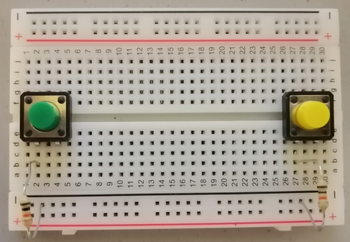
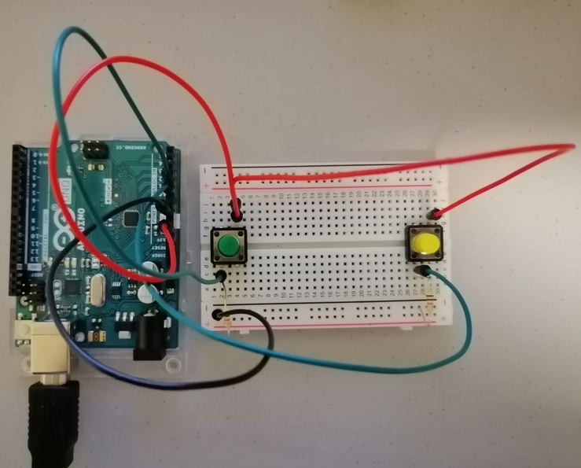

# April 13 - DREAMCATCHER
## Description: 
For this week's assignment I decided to do dreamcatcher themed game.As we know, dreamcatchers act as a way to catch and remove bad dreams. So for my game, the overall goal is to catch the bad dreams using the dreamcatcher which is at the bottom of the screen and and this is moved from side to side using the switches. 
 - A sun: good dream
 - An eclipse: bad dream
If a bad dream is caught the score increases by 50 points, and if a good dream reaches the bottom of the screen the bonus points increase by 20 points. The user begins the game with 5 lives and if a bad dream is not caught then a life is lost. After all lives are lost a final screen is displayed with the user's final score, and then the game begins again

## Process
### Processing Code
I started off by doing the processing code first. I wanted to achieve functionality using the Left and Right arrows before attempting to connect the game using the Arduino circuit and code. 
 - To begin I added the background image
 
 
 
 - Then I created and added the Dreamcatcher object and ensured that it could move from left to right using the arrow keys

 
 
 - Next up was the objects for the dreams and ensuring that they could fall. I used an array of dreams and when the previous dream reached the middle of the the next one moved.
 
  
  
 - Next up was ensuring that the Dreamcatcher could "catch" the dreams, by using the collision code and then reset the position of the dream

 

 - Lastly I added the Game Over screen and had the game restart after 10000 microseconds.

 


### Arduino Circuit
For the circuit I decided to keep things really simple and just try to see if I could obtain game functionality using the two switches.
 - Firstly I started by adding the switches to the circuit


 - Then I added the resistors for the switches



 - Then I connected the wires to the switches and to the corresponding Arduino pins


 - And lastly I added the 5V and GND wires



## Arduino Code
Lastly, was my Arduino code. Given the simplicity of my circuit, the code was simple as well. I had two variables, leftSwitch and rightSwitch which read from the sensors and then printed them to processing.
 ```
 void setup() {
  // put your setup code here, to run once:
  Serial.begin(9600);
  Serial.println("0, 0");
}

void loop() {
  // put your main code here, to run repeatedly:
  while (Serial.available()) {
    if (Serial.read() == '\n') {
      int leftSwitch = digitalRead(A0);
      delay(1);
      int rightSwitch = digitalRead(A1);
      delay(1);
      Serial.print(leftSwitch);
      Serial.print(',');
      Serial.println(rightSwitch);
    }
  }
}
```

## Challenges
 - My first challenge was remembering how to reuse processing. I forgot how to do things such as creating classes and images.
   - Solution: I consulted the reference page as well as my projects from the beginning of the semster. 
 - Another problem I had, was that after I started running Arduino and Processing the DreamCatcher was not moving. 
   - Solution: To figure out the problem I stopped Processing from running and then checked the Serial Monitor to see if the switch values were changing. Then given that the values were changing there, I tried printing them in Processing after the values were sent, to see if my code for accepting data was faulty. I realised then that what was being printed was only the fist 0, 0 values that were sent. Not being sure of what else to do I decided to remove a line of code from Arduino which was i = Serial.ParseInt(), and then the DreamCatcher started moving based onwhich switch was being presses. So I understood then that because Arduino was expecting a value, it was waiting for it before sending the switch values and that is why the code was not working. 

## Final Results
### Schematic


### Circuit


### Demo
To see the demo [Click Here](https://youtu.be/-iS2Kv273LQ)
