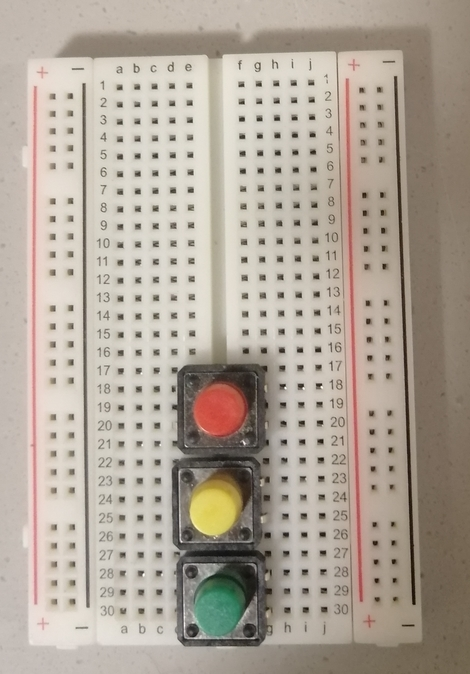
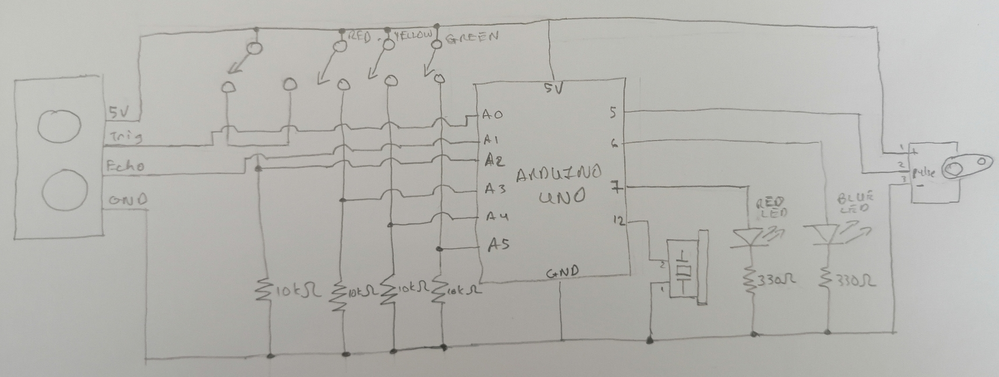

# April 6, 2021 - MUSICAL INSTRUMENT

Description:
For this week's assignment I decided to do a multi-purposed musical instrument. What I created can:
 - Play musical notes using switches 
 - Change pitch using an ultrasonic sensor
 - And provides a constant beat using the servo

To use the instrument, your hand is used as a measure to determine the pitch. The closer it is to the ultrasonic sensor, the lower the pitch and further away, the higher it is. There are four levels, and to see what level you are on, look at the Blue LED, as it will be flashing it. 
 - Pitch 1: LED flashes once
 - Pitch 2: LED flashes twice
 - Pitch 3: LED flashes three times
 - Pitch 4: :ED flashes four times

For the constant beat, when the serving is moving, ie. the toggle switch is one, the Red LED continues flashing, until the toggle switch is turned off.
## Process

### Thought Process
I was a bit all over the place this week, because I was not sure what I wanted to do. To make things more complicated,I knew I wanted a varience in pitch for the 
notes and as Professor Shiloh had mentioned using the Servo to hit something, I wanted to include this as well for a baseline.

For the notes I decided to use three switches. As it concerns the pitch, it came down to the potentiometer or the ultrasonic sensor. I thought it would be easier
to change the pitch using the latter, so that's what I went with. For the baseline, I decided to use the toggle switch, so that when it is on, the servo's action
will continue. 

- To begin, as usual I did a schematic draft
- Then I wrote the code
- And finally I started on the schematic


### Code
The code was a bit of trial and error. I tried to be as object oriented as possible, so I utilized functions, as well as classes, and different Arduino tabs: One
to store the musical notes and another for the classes.
I used an array for the notes, similar to the Arduino example. Initially, because I was still struggling to understand the ultrasonic sensor I did not include it in the code, but after adding the other elements I decided to attempt the code for it. And to determine the distance, I converted the duration of the ultrasonic output to inches, and then I constrained the value within the range for the pitches. From there I mapped the note based on the switch selection to certain indexes of the array using this distance.

````
    void NotePitch() {
      if (sendSignal == true) { // Send outgoing signal from ping Pin
        pinMode(pingPin, OUTPUT);
        digitalWrite(pingPin, LOW);
        delay(2);
        digitalWrite(pingPin, HIGH);
        timeSignalSent = millis();
        sendSignal = false;
      }
      unsigned long currMillis = millis();

      if(currMillis - timeSignalSent >= interval){ // Time to read incoming signal
        digitalWrite(pingPin, LOW);
        pinMode(echoPin, INPUT);
        duration = pulseIn(echoPin, HIGH); // Measure the time it takes for outgoing signal to echo
        distance = duration / 74 / 2; // convert from microseconds to inches
        pitch = constrain(distance, 0, 4); // Limit the distance to the pitch range
        sendSignal = true;
      }
    }    
    
    void NoteIndex(int note) { // Determine the notes to be played based on the switch selected and the pitch 
      if (pitch == 1) {
        index = note;
      }
      else if (pitch == 2){
        index = map(note, 0, 2, 3, 5); 
      }
      else if (pitch == 3){
        index = map(note, 0, 2, 6, 8);
      }
      else if (pitch == 4){
        index = map(note, 0, 2, 9, 11);
      }
      tone(TONER, melody[index], noteDuration); // Play note
    }
````
### Circuit
The circuit was a bit more complicated this week, particularly because I was using circuit elements that I had not used before. 
 - I started by adding the three switches
    - The Green for the note A
    - The Yellow for note B
    - The Red for note C
   
   
   
- Then I added the toner, the ultrasonic sensor, and the toggle switch.


- Then I added the red and blue LEDs


- Next up were the resistors for all the switches and the LEDs


- Then I added the 5 Volts and GND Wires


- And lastly I added the wires to connect to the Arduino pins.


I had to take off the pieces quite a few times to find a good layout for everything.


## Challenges
 - Connecting the Ultrasonic sensor properly: It took be quite a bit of time to figure out how to setup the sensor and correct my code to match it. Initally when
 I uploaded the code, no distance was being measured. 
    - Solution: To figure out the problem, I looked in the Arduino examples for the Sensor example, and used that as a test for what I was doing wrong, as long with printting to the Serial Monitor. It turns out that I had not put the echo pin in Input mode, and I had set the ping Pin as output in setup. So by following the Arduino example I was able to figure out that the echo Pin had to be in Input Mode, and include making the ping Pin as Output in the same function. 
 - Another challenge I had was getting the Blue LED to flash in the correct pattern. I did not want to use delay, but I also wanted the LEDs to flash a certain number of times and then pause.
    - Solution: After sitting and thinking about it, I came up with the idea of using a counter. So I used two intervals, one for flasing the LED and another for the pause. If the counter was in the range of the number of flashes, I checked the flash interval, and if it was not, I checked the pause interval and then reset the counter.
 - After fixing the Pitch flash, I noticed that it worked properly only when a switch was pressed. That was because I called the function to determine the pitch only when a switch was pressed. So if the user was trying to change the pitch before playing a note, they would not know what specific pitch it was. 
   - Solution: Place the function to determine the  pitch outside of the if condition, so on each loop it is called. Then to play the note, place this inside the if contition that is triggered when a switch is pressed and it is the correct time to play a note.
 - One final problem that I had was that when I settng up the circuit, I found the toner kept on making sounds even through no switch was being pressed.
   - Solution: It turns out that I had put the voltage wire in the same row as the input wire to the Arduino. After removing it from that row, the toner stopped making the sounds. 


## Demo
Here is the link for my project demo: [Click Here](https://youtu.be/F9fqU8s1q_M)

Here is the link for a demo plus a project explanantion: [Click Here](https://youtu.be/_XoXh3JN6Ng)

## Final Product

### Schematic


### Circuit Board


### Musical Instrument

