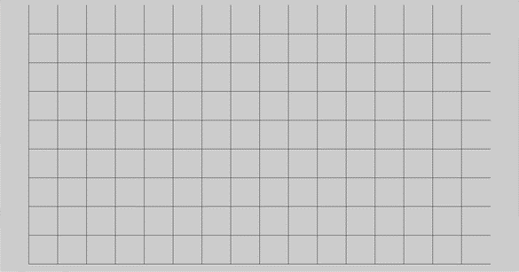
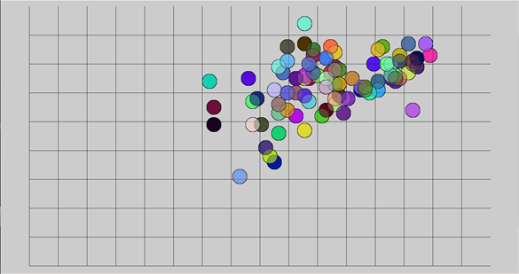
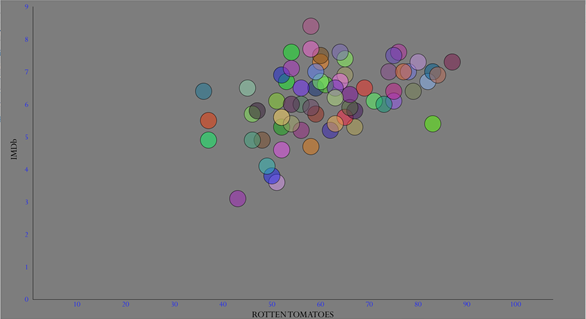
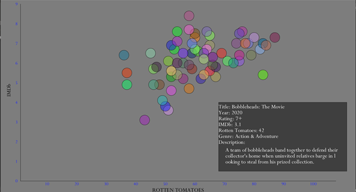
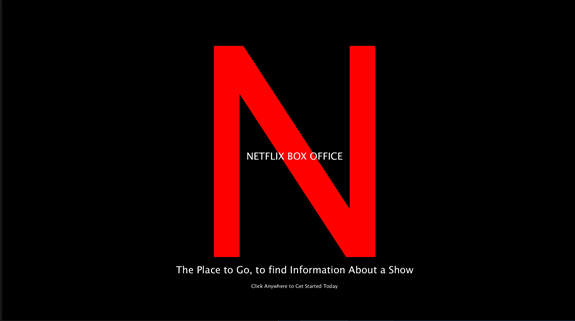

# NETFLIX BOX OFFICE - February 16
## Concept: 
NETFLIX BOX OFFICE is a Data Visualization project with the data being a collection of information on different Netflix Movies. This information includes the movie:
- Title
- Year
- Rating (Age Wise)
- IMDb Score
- Rotten Tomatoes Score
- Genre
- Description

A graph is displayed to the user, with each circle representing a movie. Based on the IMDb and Rotten Tomatoes the user can then place the mouse over a circle and 
have the movie information displayed to them in a box to the bottom right. 

## Process:

### Horizontal and Vertical Axis 
I started out by drawing the horizontal and vertical axes, using a for loop with vertical and horizontal lines to see the scale. 
The origin was translated to a new point (100, 920), in order to get the right angle design.

### Movie Class
Then I created a Movie class. This was used to create an arraylist of movies. To display the circles, their x and y location on the graph were found using the scales of the axes,
and a random colour was chosen to fill the circles, with a slight transparency. 

### Background and Axes Labelling
Then I changed the background colour to a shade of grey, removed the extra vertical and horizontal lines. Using the same for loop that gave the vertical and horizontal lines, 
inside was placed lines of code to add the numbering for the scale. And then finally the axes labels were added. For the vertical axis, another translation had to take place 
to (-50, -460). These values were used because of the previous translation to the graph origin. And then the IMDb label was rotated 270 degrees (PI+PI/2). 

### Displaying the Movie Information
Most Important of all, a rectangle was added to the bottom right, so as to display the texts of the movie Title, Year, Rating (Age Wise), IMDb Score, 
Rotten Tomatoes Score, Genre and the Description.
- A for loop was used to limit the number of characters displayed for the description for every line except the last line. 
At this point I had to learn to use string indexing so as to only display a certain number of characters for each line. 
Source: https://docs.oracle.com/javase/tutorial/java/data/manipstrings.html
- Then for the last line, I displayed all the remaining characters.

### Start Screen
I wanted to add a Start Screen to make the project seem more whole. This screen has the Netflix N and a catchy explanation of what the program does. 
Then based on a mouse press event, the user is brought to the graph. 

## Difficulties
- A major difficulty was string indexing. I had thought that because strings are arrays of characters elements could be accessed with square brackets. 
However, this is not the case and the .substring(int startIndex, endIndex) method must to be used.
- Another difficulty was figuring out how to display only one movie’s information at a time. Some movies will have similar scores and so their circles will overlap. 
Based on the code, if the mouse is within the circle the movie information should be displayed. However, I couldn’t figure out a way to have only the circle on 
top’s information be displayed. 

## Discoveries
- My major discovery was using the .substrings method for string indexing. The formatting is
  - string substring(int startIndex, endIndex)
  - If you want from a certain index to the end of the string just place the startIndex alone: string substring(int startIndex) 

