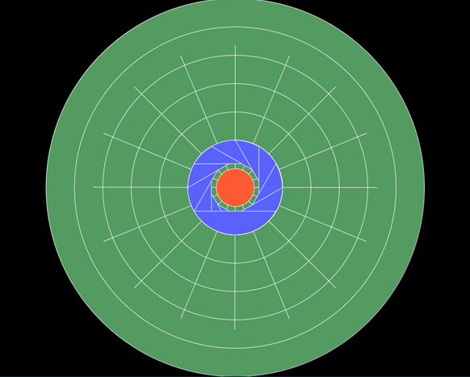

# Assignment - February 2, 2021
## Description
Using loops (for() or while()) in some way, along with everything that you've learned so far, make a simple work of art. 

## Screenshot

## Difficulties and Discoveries
The difficulties I faced in this assignment was with regards to two things:
- Rotating the arcs in order to create a sort of camera shutter shape (I really like rotating).
- As well as embracing my creative side. 

For the prior I had to calculate the correct angles to start and end the arc, as well as figure out what angle to rotate it by. I am thankful that it worked out in the end
but I did not anticipate how much math would be required.

For the latter it proved more difficult than a mathematical calculation. I would not say that I am very artistically inclined, and although the artwork my be simple, I tried my
best and hope that it will suitable enough.

I did discover that when the origin is has been translated from the top left corner, it is then necessary to use negative values in order to add elements above and to the left
of the origin. 
