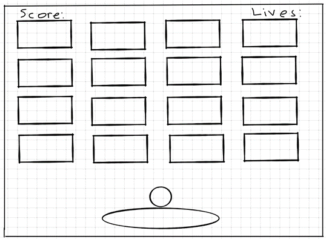
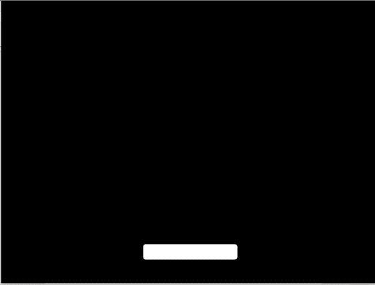
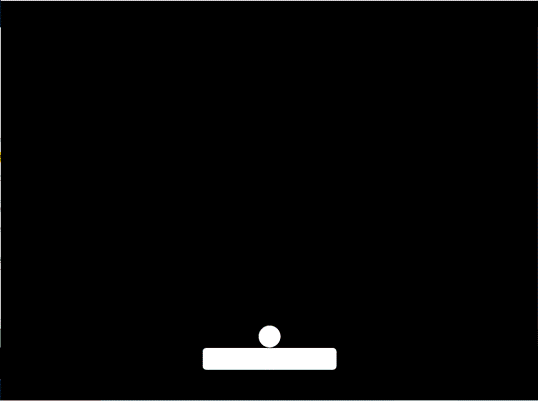
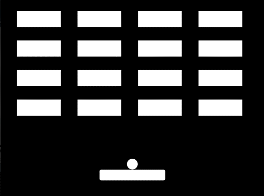

# Assigment - February 9, 2021
## Description 
Have you ever had a Blackberry? Are you familiar with the Brick Breaker Game? Well, if not, click here. For this week’s assignment I have decided to take inspiration from this game and do a simpler version. It involves a ball being bounced around the screen, in an effort to hit all the blocks, destroying them in order to win the game. The goal is to complete this task before all lives are lost or it is GAME OVER. The game begins with a press of the mouse in order to get the ball moving. If the ball misses the slider and hits the bottom of the screen, a life is lost and the ball and slider’s position is reset.

## Initial Outline

## Improvements Over Time

#### The slider

#### The slider and the ball

#### The slider, ball and the bricks

## Final Product

#### The Game

#### WIn Screen

#### Game Over Screen

## Additional Inspiration
For the background I was also really inspired by Thais’ raindrops in her February 2 assignment so, I attempted to do something similar but what looked more like stars streaking through the sky.

## Difficulties
- The major problem that I had was with the collision of the ball and the blocks. The change in X or Y speed depended on knowing which side of the block was to be hit. I did not realise this at first and so spent quite a bit of time trying to figure out why the ball was not bouncing off the blocks. 
  - Solution: Using a temporary variable to check if a change in the x or y value would move the ball or rather bounce, it off of the block. If after the change in x, the ball was still ouching the block, the y variable had to be changed and vice versa. 
- With the stars in the background, I wanted to have several of them visible at the same time. However, because I initialized all of their speeds to the same value, there was gap after they began to fall and before they were reset to their original x and y positions.
   - Randomize their ySpeeds so that some are moving faster than others, and those that arrive at the end of the screen first are reset to fill the gap that was present before.

## Anything Interesting
I wouldn’t say that there is anything extraordinary about my program, except the background, which really makes it pop, and slightly more difficult to win because it is easy to get distracted by the movement of the stars.

## Room for Improvement
- Having the user select where they would like to shoot at, rather them simply click the mouse and a random spot is chosen.
- Have additional levels, with different block designs.
- More like Brick Breaker, have the ball hit the blocks multiple times, weakening them each time, until finally they break.
