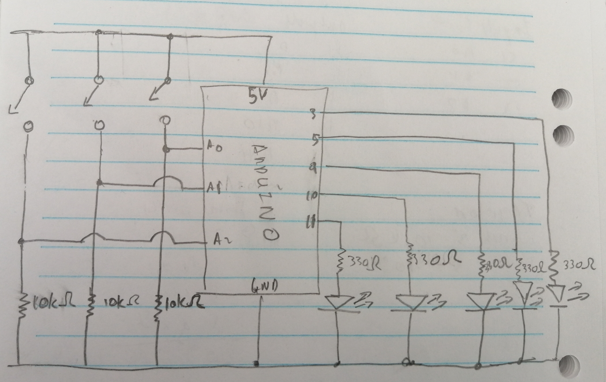
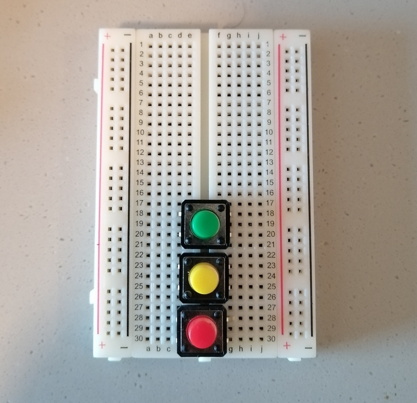
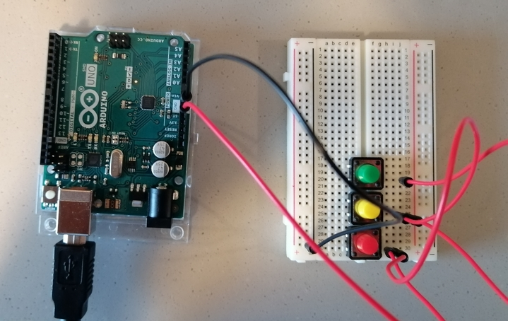

# March 23, 2021
Assignment: Using at least three momentary switches (often called buttons), and at least three LEDs, create a puzzle that can be solved by pressing the buttons. 
Each switch must not simply turn on a corresponding LED.

# Description: 
For this week's assignment I decided to do a pattern based puzzle. The pattern is randomly generated, with a total of 9 numbers from 1 to 3. 
For eg, (1, 2, 3, 3, 2, 1, 3, 3, 3). For the circuit, I used a total of 5 LEDS and 3 switches. The first switch corresponds to 1, the second switch to 2 and the 
third switch to 3. The user's goal is to use the switches to figure out the pattern to solve the puzzle. A correct switch is pressed, when the switch number 
matches the number (1-3) in the pattern. If the correct switch is pressed, the green LED flashes, and if a wrong switch is pressed, the red LED flashes and the user has to begin the pattern from the beginning. Given, that there are 9 numbers in the pattern, 3 LEDS serve as indicators of the user's progress. Once the first three correct switch selections are made, the first blue LED lights up, for the next 3 switch selections the next LED lights up and once the last three correct switches are pressed then last LED is lit. If the correct pattern is found completely, the three blue LEDS flash 5 times indicating to the user that the pattern has been found, and they can then begin the puzzle again. If a wrong switch is selected, all lit blue leds are turned off.

## Process
The first thing I did for the puzzle, was come up with the general idea. Then I considered how many switches, LEDS, and wires I needed, as well as the corresponding input and output ports on Arduino that had to be used. From this I then came up with a preliminary schematic. 

Next I used the schematic to start building the circuit.

- First I added the three switches. The numbering begins from the bottom, therefore Red Switch = 1, Yellow Switch = 2, Green Switch = 3.

- Then I added the Ground and 5 V wires, and connected the 5V wires to each switch as well as the input wires for the switches and connected them to Arduino

- Then I added the resistors for each switch and connected them to ground.(In hindshight I maybe should have added these before the wires).

- Then I added the LEDS and their corresponding resistors. To organise them in an attractive way, I placed the three Blue LEDS to the left , and the Red and Green LEDs to the right. 

- Because the red and green LEDs are on the right, therefore I had to add another ground wire, to connect these LEDs' resistors to ground. I also added the wires for each LED and connected them to Arduino.

And thus my circuit was finished (Or so I thought)

Next up was the code.
- I used a predefined array of numbers for the patterns, so I could test to see if the code was written properly and if the circuit was connected properly. 
- After debugging, this was changed to an empty array that was to be filled with random integers, from 1 to 3, in setup.  

## Problems
- After writing the code, I uploaded it to Arduino and immediately met a problem: The circuit had power but it was not reaching the LEDs. Here I realized that I connected the LEDs and the resistors incorrectly. I forgot that the negative (shorter) part of the LED had to be connected to the resistor. So I switched around all the LEDs and we had power!
- However, I then encountered another problem. Only the green LED was flashing even if an incorrect switch was pressed. I figured out that this was because in my code, my if condition had 1 equal sign instead of 2, and then once that was changed the code worked. 

## Final Product

Here is the official Circuit Schematic

And here is the final circuit:

Next up we have a video demonstration:
[Click Link](https://youtu.be/xk6yf8KRF3Q) to see video for the puzzle game

## Takeaways
- Starting with the schematic saves a lot of time on the breadboard.
- Ensure the resistor and LEDs are connected properly.
- Save the wires for last. This allows for the installation of switches, LEDs and resistors to be much easier.
- Organisation is key, so as to not have the circuit become extremely confusing.

