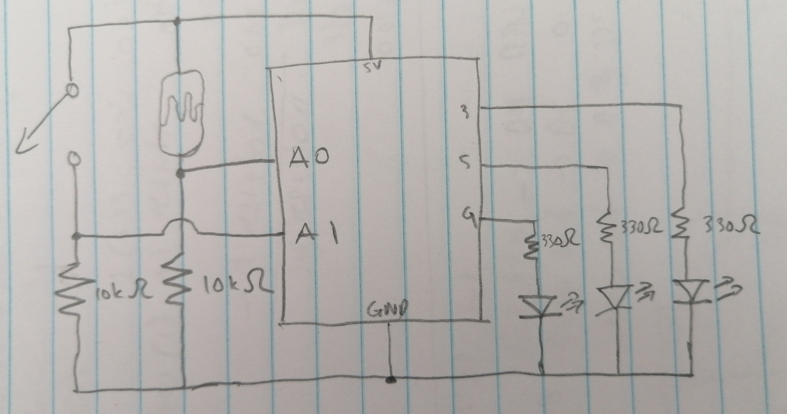
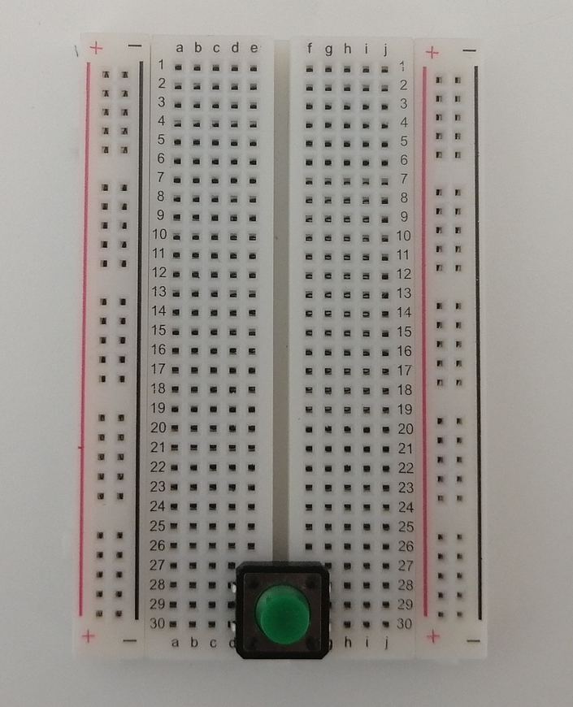
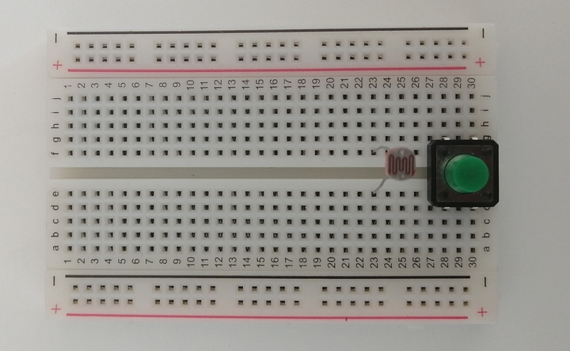
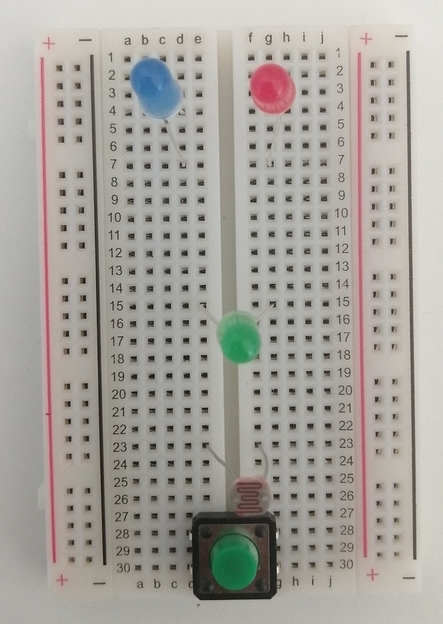
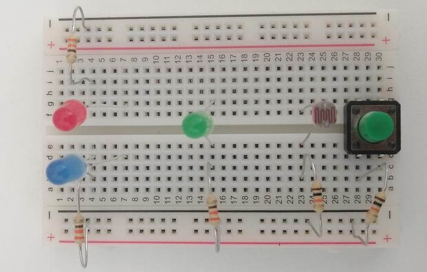
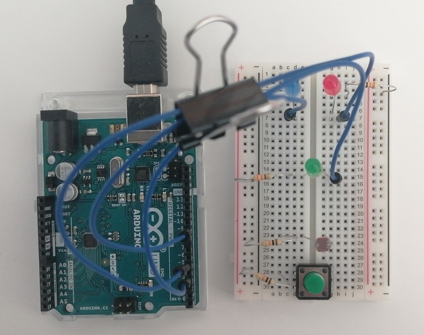
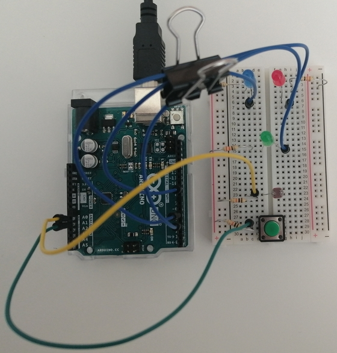
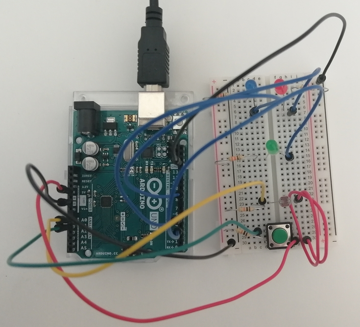
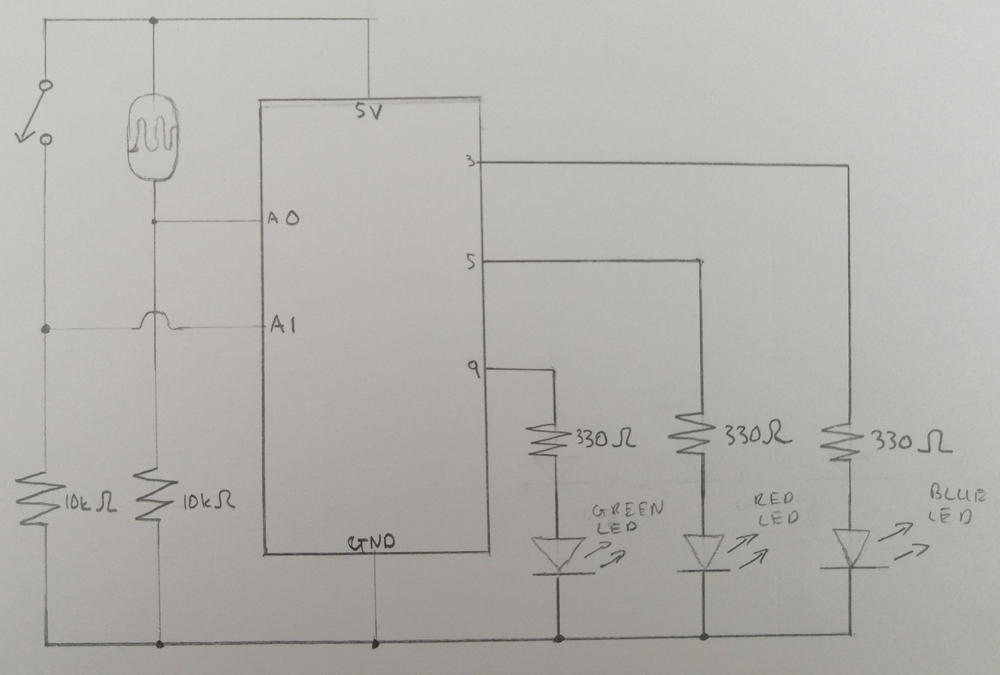
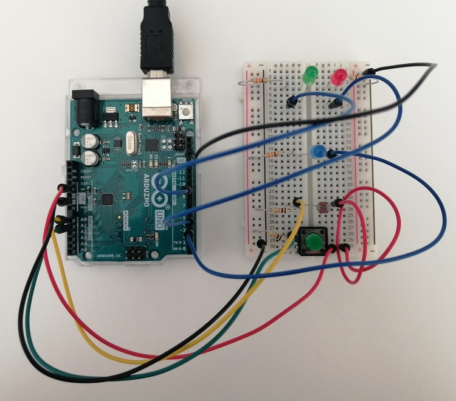

## ARDUINO CREATIVE ASSIGNMENT - MARCH 30, 2021
Description: For this week's assignment I decided to do a Morse Code inspired Circuit. The circuit has 3 LEDS, a switch and a LDR. The overall concept is that 
depending on the light presence in the room, the Green and Red LEDs flash a word in Morse Code. The Red LED represents
the dots and the Green LED represents the dashes in Morse Code. So if there is a lot of light in the room, ie day, the word
"sun" is flashed using Morse Code. If there is little light in the room, ie night, the word "moon" is flashed in Morse Code.
To signal that the word is about to be flashed, both LEDs blink twice. If the switch is pressed, the word "eclipse" is flashed.
Lastly, there is a Blue LED, that indicates what word is being blinked.
 - For sun: it is very bright
 - For moon: it is extremely dim
 - For eclipse: it is not so dim and not so bright


### Process
 - Firstly, I created a draft schematic draft for my circuit

 
 
 - Then I added the switch



 - Then I added the LDR



 - Then I added the LEDS



 - Then the resistors were added for the LEDs, the LDR and the switch



 - Afterwards I added the wires for the LEDs and connected them to the Arduino



 - Then I added the wires for the LDR and the switch



 - And lastly, I added the ground and 5 Volts wires.
 
 
 
 ### Writing the Code
The words were found using the website [Morse Code Translator](https://morsecode.world/international/translator.html). All I had to do was type in the word, and it returned it in Morse Code with dots and dashes.

For the code, I used three arrays for each word, with integers corresponding to the different components of the Morse Code
  - 1 : A dot
  - 2 : A dash
  - 3 : A space

These were then used in a for loop with if conditions to determine which LED was to be flashed. Additionally, I used a function flash that iterated through the arays and did the necessary flashing. 

````
  //flash the morse code depending the array element
  for (int i = 0; i < len; i++){
    
    if(morseCode[i] == DOT){
      digitalWrite(REDLED, HIGH);
      delay(delay1);
      digitalWrite(REDLED, LOW);
    }
    else if (morseCode[i] == DASH){
      digitalWrite(GREENLED, HIGH);
      delay(delay2);
      digitalWrite(GREENLED, LOW);      
    }
    else if (morseCode[i] == SPACE){
      delay(delay2);
    }
    delay(delay1);
    
  }
````

#### Problems
I did not have any problems when building my circuit but I did encounter a few problems with my code

- First and foremost, I had a problem figuring out the length of the array to use in the for loop: I tried using array.length but it did not work. 
  - Solution: I found out that for Arduino, you have to use the sizeof() function but this returns the number of bytes in the array.
For integers, each number is 2 bytes, so when using sizeof, it is necessary to divide by an element in the array, to get the correct calculation.
So the code was (sizeof(array))/ array[0]. I'm not sure why but this still did not work for me. The for loop only ran once. 
So instead, I passed the array size to the function and used that as the restriction for the for loop.

- Additionally, I had an issue with the dimness of the Green LED: In the beginning, as you will see in the photos, I was using a Blue and Red LED for the Morse Code flashing, and a Green LED, as the time of day indicator. But when testing I realized it was very dim showing in brighness that effectively.
  - Solution: I switched the Green LED and the Blue LED which was a better substitution.


And here are the Official Schematic and Circuit Board

#### Schematic

 
 
#### Circuit Board

 
 
#### Video Demonstration
[Click Link](https://youtu.be/MUw42j5mNzg) to see video for this week's project

## Takeaways
- The certain LEDs and their brightness are more suitable for certain tasks than others
- Determining the length of an array is found using sizeof(array)/array[0], as sizeof returns the number of bytes
