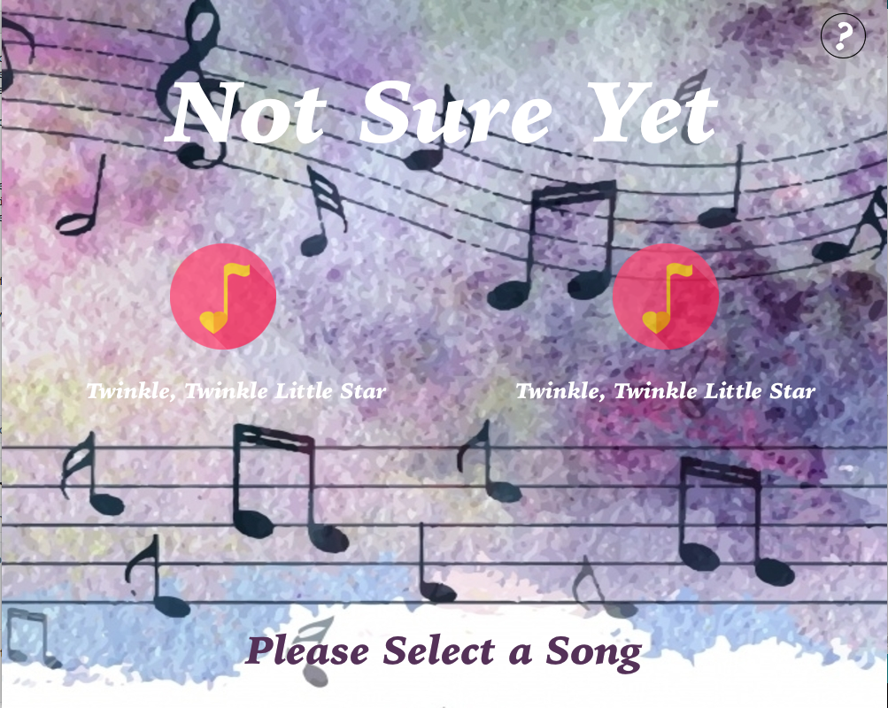
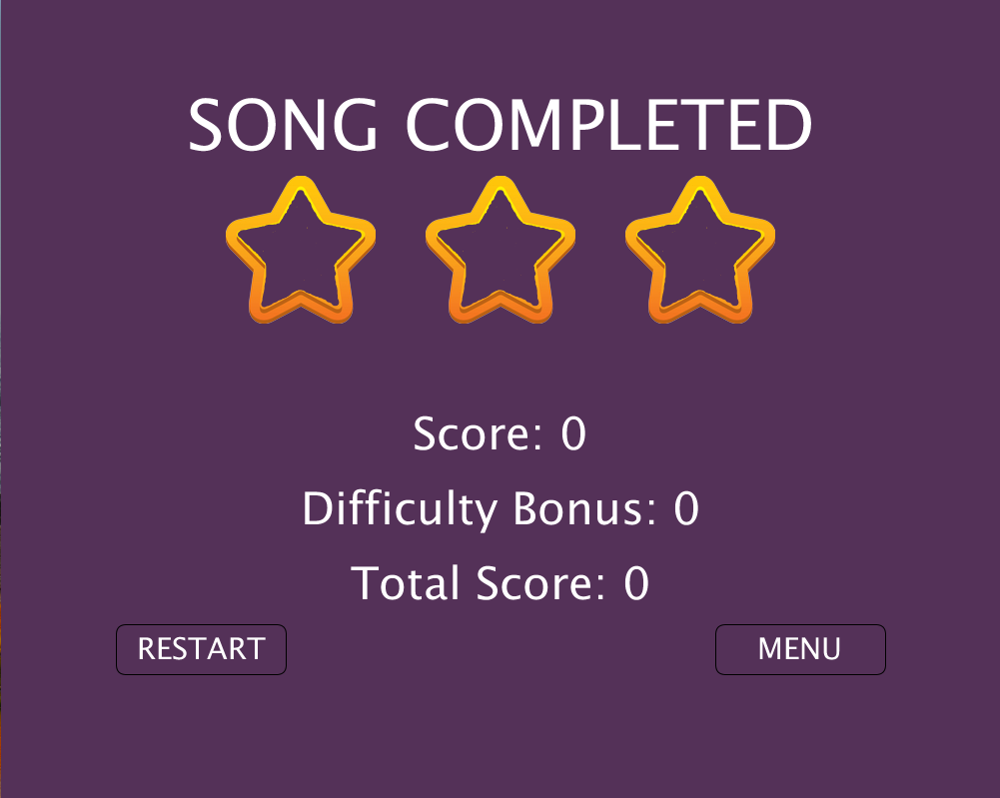

One or more photographs of your project

Major problems, if any, and solutions, if any

Clever or difficult things about your project

A link to the video

# Switch Notes

## Description

For my Final Project, I decided to do a Piano Tiles inspired game called Switch Notes. Piano Tiles is a game where different tiles appear to fall down the screen and the user presses them at a speed and time that matches the length of the tile and the music being played. For my version I decided to do something similar using switches. So the user sees a note which appears on the screen, falling within 1 of 4 lanes. When it arrives at the bottom of the screen, in the play zone, the matching switch is pressed. If the note is within the zone and the correct switch is pressed, then a sound is played for th note and the score is incremented.

If the note is enitrely in the play zone, the score increases by 100
If the note is only partly in the play zone, the score increases by 50

There are two song options
 - Twinkle, Twinkle, Little Star
 - Jingle Bells
 
The overarching goal is to obtain the most points possible for each song, by being as accurate as possible when pressing the switches. Try and have the notes be entirely in the play zone.

Additionally, it is possible for the user to change the speed of the game by using a potentiometer. This has to be done before the game begins, and the higher the speed, there is a greater amount of bonus points. 

And if the incorrect switch is pressed or a switch is not pressed the game the user does not gain the points.

Initally, I had planned on two more things
 - Having a sort of trail for notes with a longer length and having the user hold down the switch for the length of the trail. However, given the time constraints and my inability to come up with a solution, I decided to focus on other aspects of the project instead. 
 - Also, I had intended on having base music being played to accompany the notes, but I realized then that that was not necessary, as the notes themselves make up the essence of the song. 

## Process

### Classes
For this project, I used two classes, one for the notes themselves, and another for the Songs. I began the game with only the notes class but decided to add the latter later on as I wanted to use two songs.

### Initial Design
To do this project, I first began by doing a general outline of the game design and the notes, which I initially just had as circles. 

The lanes were simple, just drawing lines and the same was for the play zone. I used my DreamCatcher code as it had a similar idea for falling notes, with each circle beginning to fall after the one before reached a certain point on the screen.


### Imagery

The next step was the imagery for the game. I found two pictures and decided to use them as follows:

The background: 


The note: 


**Product**


### Playing a Note
Having added the images, to temporarily "play" the note, I decided to use keypressed, with these four keys being pressed, a, s, d, f, for the lanes 1, 2, 3, 4, respectively. I placed this in a function called check, and added the variable _playLane_ to keep track of the lane. If it is that Arduino will be constanly sending back values, it makes sense that _playLane_ can either have values matching the lanes or not, so if a note is not being pressed, or a wrong key is pressed, the value of _playLane_ is 0. Additionally, the note image is overlayed with a purple circle to signify that it has been pressed. 

```
void check(){
  if (keyPressed){
    if (key == 'a'){
      playLane = 1;
    }
    else if (key == 's'){
      playLane = 2;
    }
    else if (key == 'd'){
      playLane= 3;
    }
    else if (key == 'f'){
      playLane = 4;
    }
    else {
      playLane = 0; 
    }
  }
  else{ // This will not be necessary when Arduino is added, because only those four switches would be able to be pressed. 
    playLane = 0;
  }
}
```

Product


### Incrementing the Score
For the score, it is incremented depending on the location of the note relative to the play zone when a switch is pressed. If the note is perfectly in the drop zone then the score increases by 100, if only marginally inside, then the score increases by 50. I initially had a global variable called score that was incremented, but when I added a class for each song, _Song_, the score is a variable within the class.

```
  void pressed(){
    int laneSwitch = playLane;
    if (laneSwitch == lane && played == false){ // If the note's lane matches the lane that is being pressed, and the note has not been played
      if(y-(nHeight/2)>= barHeight && y+(nHeight/2)< height){ // Note perfectly in play zone
        played =  true;
        songs[songIndex].score += 100; // Score increases 
        colour = true;
        noteToPass = note; // Note to pass to Arduino
        lengthToPass = len; // Length to pass to Arduino
       
      }
      else if (y-(nHeight/2)< barHeight && y+(nHeight/2)>= barHeight){ // note only marginally in play zone (bottom half inside)
        played = true;
        songs[songIndex].score += 50; // Score increases by half
        colour = true;
        noteToPass = note; // Note to pass to Arduino
        lengthToPass = len; // Length to pass to Arduino
      }
      else if (y-(nHeight/2)> barHeight && y+(nHeight/2)> height){ // Note only marginally in play zone (top half inside)
        played = true;
        songs[songIndex].score += 50; // Score increases by half
        colour = true;
        noteToPass = note; // Note to pass to Arduino
        lengthToPass = len; // Length to pass to Arduino
      }
    }
  }
```

### Arduino Circuit

After having basic code functionality, I decided to start working on my circuit. 

I began by first having a ciruit with the switches and the toner, just to try and see if I could get the communication between Arduino and Processing to work. The noteduration was constant for all notes, but later on I decided that to make the songs more accurately played, to give them different note durations based on the type of note on the song's msuical sheet. 

```
void playNote(){
  if (note != 0){
    int index = note - 1;
    
    if (noteSpeed == 3){
      noteSpeed = 4;
    }
    if (len == 1){ // Length = 1 beat 
      int noteDuration = 500/noteSpeed;
      tone(TONER, melody[index], noteDuration); // Play note for specific note duration
    }
    else if (len == 2){ // Length = 2 beats 
      int noteDuration = 1000/noteSpeed;
      tone(TONER, melody[index], noteDuration); // Play note for specific note duration
    }
    else if (len == 4){ // Length = 4 beats
      int noteDuration = 2000/noteSpeed;
      tone(TONER, melody[index], noteDuration); // Play note for specific note duration  
    }
    else if (len == 5){ // Length = half a beat 
      int noteDuration = 250/noteSpeed;
      tone(TONER, melody[index], noteDuration); // Play note for specific note duration 
    }
    
  }
}
```

After that, then I added the potentiometer, to change the speed of the interval by which the notes are falling. 

The following is the schematic:


And the circuit is as follows:


### Start Screen, Help Screen and End of Level Screens

**Start Screen**

For organization, I decided to add a start screen that displays the game title, two circles which represent the different songs, and a help circle.



**Help Screen** 

For the user to figure out the functionality of the game, I added a help screen. The instructions are visible as long as the mouse is over the the help circle, in the top right hand corner of the screen.

Demo of Start Screen and Help Screen 


**End of Level Screen**

After having all the notes with fall, the song is completed. And I decided to have an end of level screen to show that the song is completed. On this screen the score, as well as bonus is displayed. To show the percentage of how well the user did, I added stars. Each star represents a third of the score, and for every third, if the sscore falls into this region the star is filled. Otherwise the str is empty. I also added two buttons, one for restarting the song, and another for returning to the main menu.



### Second Song

I began the game with one song, Twinkle, Twinkle, Little Star, and used this to figure out the functionality of the game. A text file was used to store the song notes and their corresponding lengths. I made another text file to store the next song's notes and lengths, Jingle Bells.

### Music

And the last thing I did was to add sound files, which were loaded and played, one as background music for the start screen, and another to signifiy that the level had been completed. 

This was how Switch Notes was achieved.

### Problems
- Trail/Shadow: The initial plan I had included the trail. The user would have pressed the switch for the length of it. I spent quite a bit of time trying to figure out a way to do this but I could not. Area for future study.
- Reading from file and splitting gave me a bit of trouble because of mismatching data types. 
  - But I eventually realized that since my data is made up of integers, int[] var = int(split(s, ',')), works. I had to print several times and consult the lecture notes in order to figure this out.

 - Another problem I had was concerning a lag. When I initially began using the images, the notes had a sort of trial behind them. Firstly I had the circle from my initial design still being drawn despite the fact that the image was there. Secondly I had my for loops within one another. I should have picked up on this when i tried to use i as the variable in the second for loop and I got an error, but that's why the lag was there. 
   - To fix it, I removed the circle, and had the for loops separately, and it began to run smoothly
 - Timing the Lengths: I had a problem trying to figure out a way to have the notes play at an accurate speed. Meaning that firstly, when falling multiple notes were not in the play zone at the same time, and secondly that when Arduino playes the note, the duration of one finishes before the next note that would end up in the play zone. 
   - The solution for this was a bit tricky. I did a bit of math to figure out the right distance to keep ebtween the notes on screen in Processing, by measuing the playZone and bearing in mind the height of the fallin note. Then, as I wanted to play the notes with different lengths, I used math again to find in regular music the time taken for 1 beat and then used this as the basis for the other note lengths. 
 - Lag: In the beginning, Arduino appears to be sending the speed value to Processing very quickly. Despite being accepted, the time was so fast that if I immediately started playing a song, the interval and difficulty bonus had not been determined. 
   - For this problem, I had a sort of delay in the beginning where the screen appears to slowly load in which a rectangular square slowly becoming transparent. This gives Processing enough time to make all the necessary decisions. 


