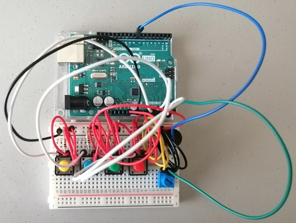

A description of your concept and how it was achieved

A picture of your circuit schematic

One or more photographs of your project

Major problems, if any, and solutions, if any

Clever or difficult things about your project

A link to the video

# Switch Notes

## Description

For my Final Project, I decided to do a Piano Tiles inspired game called Switch Notes. Piano Tiles is a game where different tiles appear to fall down the screen and the user presses them at a speed and time that matches the length of the tile and the music being played. For my version I decided to do something similar using switches. So the user sees a note which appears on the screen, falling within 1 of 4 lanes. When it arrives at the bottom of the screen, in the play zone, the matching switch is pressed. If the note is within the zone and the correct switch is pressed, then a sound is played for the using the note and the score is incremented.

If the note is enitrely in the play zone, the score increases by 100
If the note is only partly in the play zone, the score increases by 50

There are two song options
 - Twinkle, Twinkle, Little Star
 - Jingle Bells
 
The overarching goal is to obtain the most points possible for each song.

Additionally, it is possible for the user to change the speed of the game by using a potentiometer. This has to be done before the game begins, and the higher the speed, there is a greater amount of bonus points. 

And if the incorrect switch is pressed or a switch is not pressed the game the user does not gain the points.

Initally, I had planned on two more things
 - Having a sort of trail for notes with a longer length and having the user hold down the switch for the length of the trail. However, given the time constraints and my inability to come up with a solution, I decided to focus on other aspects of the project instead. 
 - Also, I had intended on having base music being played to accompany the notes, but I realized then that that was not necessary, as the notes themselves make up the essence of the song. 

## Process

### Initial Design
To do this assignment, I first began by doing a general outline of the game design and got the notes, which I initially just had as circles. 

The lanes were simple, just drawing lines and the same was for the play zone. I used my DreamCatcher code as it had a similar idea for falling notes, with each circle beginning to fall after the one before reached a certain point.


### Imagery

The next step was the imagery for the game. I found two pictures online and decided to use them as follows:

The background: 


The note: 


### Playing a Note
Having added the images, to temporarily "play" the note, I decided to use keypressed, with these four keys being pressed, a, s, d, f, for the lanes 1, 2, 3, 4, respectively. I placed this in a function called check, and added the variable _playLane_ to keep track of the lane. If it is that Arduino will be constanly sending back values it makes sense that _playLane_ can either have values matching the lanes or not, so if a note is not being pressed, or a wrong key is pressed, the value of _playLane_ is 0.

```
void check(){
  if (keyPressed){
    if (key == 'a'){
      playLane = 1;
    }
    else if (key == 's'){
      playLane = 2;
    }
    else if (key == 'd'){
      playLane= 3;
    }
    else if (key == 'f'){
      playLane = 4;
    }
    else {
      playLane = 0; 
    }
  }
  else{ // This will not be necessary when Arduino is added, because only those four switches would be able to be pressed. 
    playLane = 0;
  }
}
```

### Incrementing the Score
For the score, it is incremented depending on the location of the note relative to the play zone when a switch is pressed. If the note is perfectly in the drop zone then the score increases by 100, if only marginally inside, then the score increases by 50. I initially had a global varaible called score that was incremented, but when I added the Song class, the score is a variable within the class.

```
  void pressed(){
    int laneSwitch = playLane;
    if (laneSwitch == lane && played == false){ // If the note's lane matches the lane that is being pressed, and the note has not been played
      if(y-(nHeight/2)>= barHeight && y+(nHeight/2)< height){ // Note perfectly in play zone
        played =  true;
        songs[songIndex].score += 100; // Score increases 
        colour = true;
        noteToPass = note; // Note to pass to Arduino
        lengthToPass = len; // Length to pass to Arduino
       
      }
      else if (y-(nHeight/2)< barHeight && y+(nHeight/2)>= barHeight){ // note only marginally in play zone (bottom half inside)
        played = true;
        songs[songIndex].score += 50; // Score increases by half
        colour = true;
        noteToPass = note; // Note to pass to Arduino
        lengthToPass = len; // Length to pass to Arduino
      }
      else if (y-(nHeight/2)> barHeight && y+(nHeight/2)> height){ // Note only marginally in play zone (top half inside)
        played = true;
        songs[songIndex].score += 50; // Score increases by half
        colour = true;
        noteToPass = note; // Note to pass to Arduino
        lengthToPass = len; // Length to pass to Arduino
      }
    }
  }
```

### Arduino Circuit

After having basic code functionality, I decided to start working on my circuit. 

I began by first having a ciruit with the switches and the toner, just to try and see if I could get the communication between Arduino and Processing to work. 

After that, then I added the potentiometer, to change the speed of the interval by which the notes are falling. 

The following is the schematic:

And the circuit is as follows:



### Start Screen and End of Level Screens

### Song Restarting

### Potentiometer

### Second Song

### Music

### 


### Problems
- Lag,


