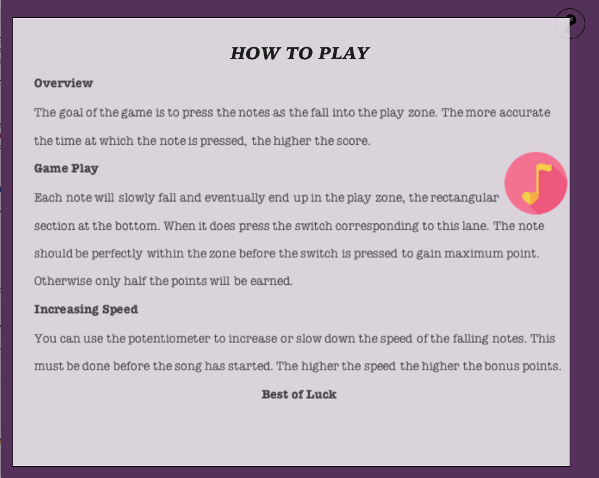
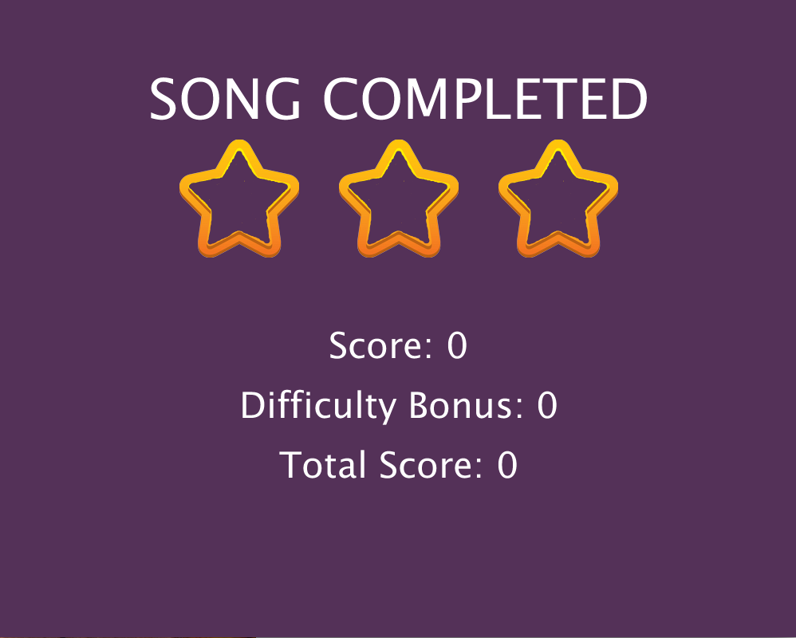
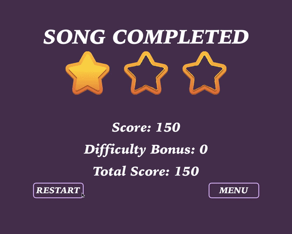

# Final Project
### Preliminary Description
For my final project, I would like to do an Arduino and Processing Version of [Piano Tiles](https://en.wikipedia.org/wiki/Piano_Tiles_2). Piano Tiles is a game where the user presses the black tiles on the screen at a speed and time that matches the length of the tile and the music being played. For my version I would like to do the same thing but have it insted be with switches.
So the user would see the tile/note appear on screen and when it arrives at the bottom of the screen, the matching switch has to be pressed for the corresponding amount of time as the length of the note. The base music would be playing, and the user, pressing the keys would hear the actual song itself if they are pressed correctly. For each correct switch that is selected and the correct length that the switch is held, the user gains points. If the incorrect switch is pressed or a switch is not pressed the game the user does not gain the points. THe overarching goal is to gain the highest score possibe, ie. pressing every switch correctly and for an accurate amount of time
I would like to have 2 to 3 songs that the are preloaded that the user can play, each one a bit more difficult than the next

#### Arduino: 
The circuit would utilize:
 - four switches which would act as notes to be pressed.
 - Additionally there would be the toner to play the music for the songs, as well as the notes for the different switches.
 - I am debating whther or not to add LEDS to flash depending on the note being played.
 - I am also debating adding a potentiometer so that the user can change the speed of the level to make things harder. 

Arduiono would be sending to processing the values of the different switches. Annd depending on which switch was being pressed the toner would play the corresponding sound. 


#### Processing: 
Processing would display a screen of four lanes and at the bottom of the screen there would be four slots, each representing a switch and a note. When the note is in the slot that is when the switch must be pressed. If a note has a shadow then the switch has to be presed for the length of the shadow. If the note
does not have a shadow then the switch only needs to be pressed and released.
These four lanesand the notes would each have their own colours to act as an additional guide for the user.
When a song is completed the user's score is displayed, as well as how many incorrect notes were pressed. Then they can either restart the song, or return to the main menu. 

Processing would accept from Arduino the values of the different switches to determine which one is being pressed and if it matches the correct note on screen at the right time.

If a potentiometer was added, Processing would accept the value and use it to change the interval by which the objects on the screen are moving. 

#### Sketches


## April 19, 2020
### Goals
 - Create 
 
 File of Notes
 - Complete initial layout
 - Figure out how to get notes to fall

#### What I accomplished
**Initial Layout** 

For the initial layout, as shown in my sketch, I came up with four lanes and the drop zone at the bottom where the switch is to be pressed to play the note


For now, I decided to not add the background imagery, or the picture for the notes, just to see if I could get functionality first. I decided to use my code from the previous week's assignment, DreamCatcher and modified it to represent a note. At the moment, the moving circle's are the notes. Initially I used an array of seven notes, and a new one started moving each time the previous one had been on screen for 120 frames or 2 seconds. 


**Create Text Files**

Then I created a text file with the notes for Twinkle Twinkle Little Star, as that is what I am using as my song, and read from the file these notes and added them to each note object. In total Twinkle Twinkle Little Star has 42 stars and that's why so many of them are falling.

Click Image to See Demo

[](https://youtu.be/zkO3Ew7QxL8)

#### Takeaways
 - The more notes there are, because I have a for loop for the shifting of each note, it becomes very laggy, so I need to find a way to improve on that
 - At the moment, it is not as if I have a time variable for each note, so how would I do the shadow element? I know that the note immediately after cannot be in the same lane, the other notes would have to stop for a moment, while that note finishes and then everything continues. 

## April 20, 2020
### Goals
 - Add Images for The Background and the Notes

#### What I accomplished

**Background**

I resized the background image and then added the image to the game. Then I redid the lane lines in purple with an increased stroke weight so that they are much clearer. I'm happy with how it turned out. 


**Game Images**

Next up was the imagery for the notes. I resized the picture to the size in the game and then loaded it in setup and added it to the image variable for each note. Notice that there is a trail and lag which I need to work on fixing.

Here is the note for the image


And this is how it looks in the game


Okay, so I realize now why the lag and trail were there. Firstly I had the circle still being drawn despite the fact that the image was there. Secondly I had my for loops within one another. I should have picked up on this when i tried to use i as the variable in the second for loop and I got an error, but that's why the lag was there. Now things are running smoothly.

New Code for the for loops
```
void shift(){
  if (frameCount >= start){ // Game Begins after 3 seconds
  
    if(noteIndex == 0 && notes[0].start == false){ // When the game begins have the first note begin moving
        notes[0].start = true;
        noteIndex ++;
    }
    
    for (int i = 1; i < numNotes; i++){
      if (i == noteIndex && notes[i].start == false){ // If The current note has not started moving then
        if(notes[i-1].y >= checkPoint){ // Check if the previous note has reached checkpoint on the screen. If it has the next note starts moving
          notes[i].start = true;
          noteIndex ++;
        }
      }
    }
   
    for(int i = 0; i< numNotes; i++){ // Update the location and display each note if it has alread started moving 
      if (notes[i].start == true){
        notes[i].update();
        notes[i].display();

      }
    }
  }
}
```

**Product**


### Takeaways
 - If I add code ansure to review it so that evrything is the way that I want it
 - Add comments as I go along
 - If it is that I am going to include the note with the shadow for long notes then I need to have the following note be in a different lane, so that the sound won't overlap for the two. 
 - And I need to add some temporary check that will allow me to know for now if a note has been "played"


## April 21, 2020
### Goals
 - Figure out a way to temporarily "play" a note. 
 - Add the score, and increment it depending on the location of the note in the drop zone when it was pressed

#### What I accomplished
 - **Temporarily "play" note**
  
Because I haven't added the Arduino yet, to "play" a note I decided to use keypressed, with these four keys being pressed, a, s, d, f, for the lanes 1, 2, 3, 4, respectively. I placed this in a function called check, and added the variable _playLane_ to keep track of the lane. If it is that Arduino will be constanly sending back values it makes sense that _playLane_ can either have values matching the lanes or not, so if a note is not being pressed, or a wrong key is pressed, the value of _playLane_ is 0.

Code

```
void check(){
  if (keyPressed){
    if (key == 'a'){
      playLane = 1;
    }
    else if (key == 's'){
      playLane = 2;
    }
    else if (key == 'd'){
      playLane= 3;
    }
    else if (key == 'f'){
      playLane = 4;
    }
    else {
      playLane = 0; 
    }
  }
  else{ // This will not be necessary when Arduino is added, because only those four switches would be able to be pressed. 
    playLane = 0;
  }
}
```

 - **Increment score**
 
Then I figured out how to increment the score of the game, depending on the location of the note in the drop zone when it was pressed. I added the variable _score_ and if the note is perfectly in the drop zone then the score increases by 100, if only marginally inside, then the score increases by 50.

Here I also added the variable _colour_, so that when the note has been played a translucent ellipse comes over it, ie. this is from the variable _colour_ become true. 

Code

```
void pressed(){
    int laneSwitch = playLane;
    if (laneSwitch == lane && play == false){
      if(y-(nHeight/2)>= barHeight && y+(nHeight/2)< height){ // note perfectly in play zone
        play =  true;
        score += 100; // score increase
        colour = true;
        // send note to Arduino
        
      }
      else if (y-(nHeight/2)< barHeight && y+(nHeight/2)>= barHeight){ // note only marginally in play zone (bottom half inside)
        play = true;
        score += 50; // score increases at lesser amount
        colour = true;
        // send note to Arduino
      }
      else if (y-(nHeight/2)> barHeight && y+(nHeight/2)> height){// note only marginally in play zone (top half inside)
        play = true;
        score += 50; // score increases at lesser amount
        colour = true;
        // send note to Arduino
      }
   
    }
  }
```

Product


### Takeaways
 - Given that I have basic code functionality, now would be a good time to start working on the Arduino compenent. If thta works fine that I can return and add the other elements that I want
 - Note to self: For the shadow element, a bar can be used to track how long a note has been pressed. If the state of the switch fro that lane changes before the bar fills, then stop playing the sound, and give only a portion of the score.


## April 22, 2021
### Goals
 - Draw preliminary shcematic for Arduino
 - Create circuit and have it play the sounds of the the different notes.

#### What I accomplished

**Started working on my circuit**

First things first, I drew a preliminary sketch


 - I began by adding the switches and the toner


 - Then I added the resistors for the switches

 
 
 - Next up was connecting the components to their corresponding Arduino pins


 - Then I added the voltage wires and the ground wires


**After this I wrote the Arduino code, and edited my Processing code to support communication between the two.**

Processing: I had to do a bit of printing at different points to ensure that accurate values were being passed back and forth. 
So, Processing accepts the values of the different switches to check from which lane the note should be played and passes the note to be passed based on the one that is in the play zone when the switch is pressed.
```
void serialEvent(Serial myPort){ // Accept the values of the switches from Arduino
  String s = myPort.readStringUntil('\n');
  
  s = trim(s);
  if (s!= null){
    int laneValues[] = int(split(s,','));
    if(laneValues.length == 4){
      int lane1 = laneValues[0];
      int lane2 = laneValues[1];
      int lane3 = laneValues[2];
      int lane4 = laneValues[3];
      
      check(lane1, lane2, lane3, lane4);
    }
  }
  myPort.write(int(noteToPass)+"\n");
  noteToPass=0;
}
```

Arduino - I included a notes.h file which contains the sound files as well as used an array for the notes so that they were easily acessible

Arduino accepts the note that is to be played, uses this to determine the index and then plays the note for 1500 milliseconds.

```
#include "notes.h"
const int SWITCH1 = A0;
const int SWITCH2 = A1;
const int SWITCH3 = A2;
const int SWITCH4 = A3;
const int TONER = 8; 
int note=0;
const int noteDuration = 1500;

int melody[] = {NOTE_A3, NOTE_B3, NOTE_C3, NOTE_D3, NOTE_E3, NOTE_F3, NOTE_G3};

void setup() {
  // put your setup code here, to run once:
  Serial.begin(9600);
  Serial.println("0, 0, 0, 0");
}

void loop() {
  // put your main code here, to run repeatedly:
  while(Serial.available()){
    note = Serial.parseInt();
    
    if (Serial.read() == '\n'){
      playNote(note);
      // Read the state of the switches
      //Serial.print('a');
      int lane1 = digitalRead(SWITCH1);
      delay(1);
      int lane2 = digitalRead(SWITCH2);
      delay(1);
      int lane3 = digitalRead(SWITCH3);
      delay(1);
      int lane4 = digitalRead(SWITCH4);
      delay(1);

      //Send the values to Processing
      Serial.print(lane1);
      Serial.print(',');
      Serial.print(lane2);
      Serial.print(',');
      Serial.print(lane3);
      Serial.print(',');
      Serial.println(lane4);
    }
  }
}

void playNote(int note){
  if (note != 0){
    int index = note - 1;
    tone(TONER, melody[index], noteDuration); // Play note
  }
}
```
#### Problems
 - I encountered a problem here regarding the switches. At first, no sound was being played, and when I started printing in Processing the lane values were 0. So I decided to try and use Arduino separately to see what the problem was, using the Serial Monitor. Here I noticed that at Random points the switch values would change, and after closer analysis it turns out that I had not had ground connected to the circuit. I then had to mess around with the noteDuration a bit to figure out the right length for the note to play.

### Takeaways
 - I could add a length for the different types of notes that are to beplayed rather than have the same exact length each time, to make the songs more accurate.


## April 25, 2021
### Goals
 - Work on the start screen and end of level screen
 - Try doing the shadow 

#### What I accomplished
 - **Created a Song Class**
As I knew I wnated to add another song, I thought it would make sense to add a song class. This would include the array of notes, as well as variables for the noteIndex, the number of notes, the score and the bonus. 

 - **Added a start screen**

To do the start screen I found a nice background picture online that I reconfgured to fit the dimensions of the game Screen. I was not sure of a title yet, so I just wrote something to fill the space, as well as a prompt to have the game start. I knew I wanted to have two songs, so I had two note images on screen to represent each one.


At this point I found the lettering a bit bland so I added a different font


 - **Help Screen**

For the help screen, I wanted so that the user could simply move the mouse over a question mark and have it come up. To do this, I firstly added a circle in the top right corner of the screen with a question mark inside. Then, in Word and using a text box created an image for the game instructions. Then I simply wrote a bit of code to display the image, and the how to play screen was complete. 

Start Screen with Help Circle 


How to Play Screen



Demo of Start Screen and Help Screen 


 - **Added an end-of-level Screen**

For the end of level screen, I did not want to just show the overall score. So, like in other games I added some stars to show how well the user did. There are three stars, and depending on how well the user did, they vary between filled or empty. 

Filled Star


Empty Star


I also showed on screen the score, as well as a bonus which would depend on the potentiometer that I would eventually add. 



And finally I added two buttons that the user could press to restart the game or return to the menu.


 - **Figured out how to reset the song**

Given that I added a reset button on the end of level screen, it was time to figure out how to do this. 
For the song to restart, I had each note reset to a random lane, as well as reinitalize each of the song variables

```
void reset(){
    noteIndex = 0;
    songEnd = false;
    pause = false;
    score = 0;
    bonus = 0;
    
    for(int i = 0; i < numNotes; i++){
      if (i+1 % 7 == 0){ // For notes with a longer sound
        int lane = int(random(1, 4));
        notes[i].reset(lane);
        prevL = lane;
      }
      else if ( i+1 % 8 == 0 ){ // Note immediately after note with a longer sound
        int lane = int(random(1, 4));
        while (lane == prevL){
          lane = int(random(1, 4));
        }
        notes[i].reset(lane);
      }
      else {
        int lane = int(random(1, 4));
        notes[i].reset(lane);
      }
    }
  }
```

Demo of Song Restarting 


Demo of Returning to Start Screen after Song is Completed 



 - **Attempted Song 2**

At this point, I tried to find a different song to use. I settled on Our Soong by Talor Swift, and then I created another text file to include the notes. Ahead of what I would work on next, which would include the length of the note, I added the note length to each note and did the same thing for Twinkle Twinkle Little Star

 - **Shadow** 
Then I tried to work on the Shadow. I took a few hours to try and find different ways to come up with an answer, but unfortunately I couldn't. So I've decided to remove it from the code. It's an issue that I want to look in further outside of this project. 

#### Problems
 - Most definitely with the shadow. I just couldn't figure out how to do it. 

### Takeaways
 - If something is proving impossible to do, and there is a time constraint, it is okay to change your mind about it.
 - To play different song lengths, I'll need different distances between the notes, ie. different checkpoints.


## April 26, 2021
### Goals
 - Getting the notes to play based on the note length
 - Add the second song
 - Adding the potentiometer


#### What I accomplished

**Notes played according to their length**

To get the notes playing according to their lengths, I added their beats to the text file that had the notes within them. Working from this I had each note then have a corresponding checkpoint at which the next note could then start falling. I had to play around with these a bit, to find the right ones

```
Note (int LANE, int NOTE, int LENGTH){
    colour = false;
    played = false;
    start = false;
    lane = LANE;
    x = (LANE*laneWidth)-(laneWidth/2);
    y = NOTEY;
    nWidth = NOTEWIDTH;
    nHeight = NOTEHEIGHT;
    interval = NOTEINTERVAL;
    note = NOTE;
    len = LENGTH;
    img = noteImg;
    
    if (len == 1){
      checkPoint = 300;
    }
    else if (len == 2){
      checkPoint = 500;
    }
    else if (len == 4){
      checkPoint = 750; 
    }
    else if (len == 5){
      checkPoint = 260;
    }
```

It's not absolutely perfect, but I did my best.

This corresponding length was then passed to Arduino, which used this to play the note.

```
void playNote(){
  if (note != 0){
    int index = note - 1;
  
    if (len == 1){
      int noteDuration = 500;
      tone(TONER, melody[index], noteDuration); // Play note
    }
    else if (len == 2){
      int noteDuration = 1000;
      tone(TONER, melody[index], noteDuration);
    }
    else if (len == 4){
      int noteDuration = 2000;
      tone(TONER, melody[index], noteDuration);  
    }
    else if (len == 5){
      int noteDuration = 250;
      tone(TONER, melody[index], noteDuration);  
    }
  }
}
```

**Adding the Second Song**
Adding the second song took a bit of work, what I had initially used for the notes for Our Song by Taylor Swift was wrong, so I had to find another song. I settled on Jingle Bells, and then organized the notes and note lengths in a spearate text file.

I had made a Songs array, so simply initialized this other song, with the matching number of notes, after the data had been read from file.

**Adding the Potentiometer**

I began by adding the potentiometer to the circuit board.


Then I edited my Arduino to read this value, map it from 1 to 3 and write to processing. On the Processing side, this value is accepted and then used to determine the interval by which the notes will move as they fall. Depending on the speed there will be a bonus

```
if(startGame == false){
    if (speed == 1){
      noteInterval = 4;
      difficultyBonus = 0;
    }
    else if(speed == 2){
      noteInterval = 6;
      difficultyBonus = 300;
    }
    else if (speed == 3){
      noteInterval = 8;
      difficultyBonus = 600;
    }
  }
```

Demo of Song with Increased Speed


#### Problems
 - Reading from file and splitting gave me a bit of trouble because of mismatching data types. But I eventually realized that sicne my data is made up of integers, int[] var = int(split(s, ',')), works. I had to print several times and consult the lecture notes in order to figure this out.

### Takeaways
 - That's the last of the code functionality, now I need to comment my code.

## April 27, 2021
### Goals
 - Adding Music


#### What I accomplished

**Adding Music**
I realized that the game seemed a little lifeless, so I decided to add some sounds. 
 - One as a background music for the start screen
 - Another when the song is completed

For the start screen, I did a bit of googling and found a [video](https://youtu.be/ieL3VO4VWxE) on YouTube that had music that I liked. So I decided to download the audio and crop it for the section I liked. 

For the end of level screen, I used the audio from my Mid-Term project


#### Problems
 - I did not really have any problems. I had forgotten how to use audi files, but I checked my Mid-Term prject and used that as a guide, and it worked

### Takeaways
 - Consulting old projects/assignments can be helpful in new endeavours. 


## April 28, 2021
### Goals
 - Figure out why my game interval is being made 0.

#### What I accomplished
Having completed every thing else, I noticed that there would be moments when the notes would not move. To figure out what the issue was, I tried printing along different points in the code to see where the interval was becoming 0. I had it initalized as such, but it should have changed once Arduino and Processing started communicating. The value from Arduino was being accepted but the if conditions to determine the difficulty bonus and the interval were not being executed. I did some googling and I found that sometimes Arduino can be communicate faster than processing, so I decided to add a fade out in the beginning to give the two time to start communicating properly. 


#### Problems
 - 

### Takeaways
 - 


