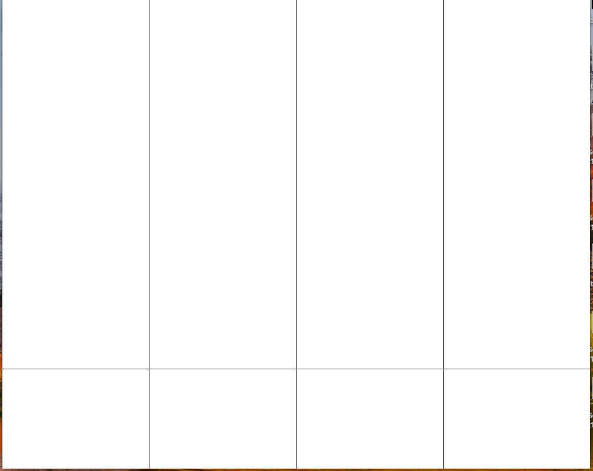

# Final Project
### Preliminary Description
For my final project, I would like to do an Arduino and Processing Version of [Piano Tiles](https://en.wikipedia.org/wiki/Piano_Tiles_2). Piano Tiles is a game where the user presses the black tiles on the screen at a speed and time that matches the length of the tile and the music being played. For my version I would like to do the same thing but have it insted be with switches.
So the user would see the tile/note appear on screen and when it arrives at the bottom of the screen, the matching switch has to be pressed for the corresponding amount of time as the length of the note. The base music would be playing, and the user, pressing the keys would hear the actual song itself if they are pressed correctly. For each correct switch that is selected and the correct length that the switch is held, the user gains points. If the incorrect switch is pressed or a switch is not pressed the game the user does not gain the points. THe overarching goal is to gain the highest score possibe, ie. pressing every switch correctly and for an accurate amount of time
I would like to have 2 to 3 songs that the are preloaded that the user can play, each one a bit more difficult than the next

#### Arduino: 
The circuit would utilize:
 - four switches which would act as notes to be pressed.
 - Additionally there would be the toner to play the music for the songs, as well as the notes for the different switches.
 - I am debating whther or not to add LEDS to flash depending on the note being played.
 - I am also debating adding a potentiometer so that the user can change the speed of the level to make things harder. 

Arduiono would be sending to processing the values of the different switches. Annd depending on which switch was being pressed the toner would play the corresponding sound. 


#### Processing: 
Processing would display a screen of four lanes and at the bottom of the screen there would be four slots, each representing a switch and a note. When the note is in the slot that is when the switch must be pressed. If a note has a shadow then the switch has to be presed for the length of the shadow. If the note
does not have a shadow then the switch only needs to be pressed and released.
These four lanesand the notes would each have their own colours to act as an additional guide for the user.
When a song is completed the user's score is displayed, as well as how many incorrect notes were pressed. Then they can either restart the song, or return to the main menu. 

Processing would accept from Arduino the values of the different switches to determine which one is being pressed and if it matches the correct note on screen at the right time.

If a potentiometer was added, Processing would accept the value and use it to change the interval by which the objects on the screen are moving. 

#### Sketches


## April 19, 2020
### Goals
 - Create Text File of Notes
 - Complete initial layout
 - Figure out how to get notes to fall

#### What I accomplished

For the initial layout, as shown in my sketch, I came up with four lanes and the drop zone at the bottom where the switch is to be pressed to play the note



For now, I decided tonot add the background imagery, or the picture for the notes, just to see if I could get functionality first. I decided to use my code from the previous week's assignment, DreamCatcher and modified it to represent a note. At the moment, the moving circle's are the notes. Initially I used an array of seven notes, and a new one started moving each time the previous one had been on screen for 120 frames or 2 seconds. 


Then I created a text file with the notes for Twinkle Twinkle Little Star, as that is what I am using as my song, and read from the file these notes and added them to each note object. In total Twinkle Twinkle Little Star has 42 stars and that's why so many of them are falling.

Click Image to See Demo

[](https://youtu.be/zkO3Ew7QxL8)

#### Takeaways
 - The more notes there are, because I have a for loop for the shifting of each note, it becomes very laggy, so I need to find a way to improve on that
 - At the moment, it is not as if I have a time variable for each note, so how would I do the shadow element? I know that the note immediately after cannot be in the same lane, the other notes would have to stop for a moment, while that note finishes and then everything continues. 

## April 20, 2020
### Goals
 - Add Images for The Background and the Notes

#### What I accomplished

Background

I resized the background image and then added the image to the game. Then I redid the lane lines in purple with an increased stroke weight so that they are much clearer. I'm happy with how it turned out. 


Next up was the imagery for the notes. I resized the picture to the size in the game and then loaded it in setup and added it to the image variable for each note. Notice that there is a trail and lag which I need to work on fixing.

Here is the note for the image


And this is how it looks in the game


Okay, so I realize now why the lag and trail were there. Firstly I had the circle still being drawn despite the fact that the image was there. Secondly I had my for loops within one another. I should have picked up on this when i tried to use i as the variable in the second for loop and I got an error, but that's why the lag was there. Now things are running smoothly.

New Code for the for loops
```
void shift(){
  if (frameCount >= start){ // Game Begins after 3 seconds
  
    if(noteIndex == 0 && notes[0].start == false){ // When the game begins have the first note begin moving
        notes[0].start = true;
        noteIndex ++;
    }
    
    for (int i = 1; i < numNotes; i++){
      if (i == noteIndex && notes[i].start == false){ // If The current note has not started moving then
        if(notes[i-1].y >= checkPoint){ // Check if the previous note has reached checkpoint on the screen. If it has the next note starts moving
          notes[i].start = true;
          noteIndex ++;
        }
      }
    }
   
    for(int i = 0; i< numNotes; i++){ // Update the location and display each note if it has alread started moving 
      if (notes[i].start == true){
        notes[i].update();
        notes[i].display();

      }
    }
  }
}
```

Product


### Takeaways
 - If I add code ansure to review it so that evrything is the way that I want it
 - Add comments as I go along
 - If it is that I am going to include the note with the shadow for long notes then I need to have the following note be in a different lane, so that the sound won't overlap for the two. 
 - And I need to add some temporary check that will allow me to know for now if a note has been "played"

## April 21, 2020
### Goals
 - Figure out a way to temporarily "play" a note. 
 - Add the score, and increment it depending on the location of the note in the drop zone when it was pressed

#### What I accomplished

Because I haven't added the Arduino yet, to "play" a note I decided to use keypressed, with these four keys being pressed, a, s, d, f, for the lanes 1, 2, 3, 4, respectively. I placed this in a function called check, and added the variable _playLane_ to keep track of the lane. If it is that Arduino will be constanly sending back values it makes sense that _playLane_ can either have values matching the lanes or not, so if a note is not being pressed, or a wrong key is pressed, the value of _playLane_ is 0.

Code

```
void check(){
  if (keyPressed){
    if (key == 'a'){
      playLane = 1;
    }
    else if (key == 's'){
      playLane = 2;
    }
    else if (key == 'd'){
      playLane= 3;
    }
    else if (key == 'f'){
      playLane = 4;
    }
    else {
      playLane = 0; 
    }
  }
  else{ // This will not be necessary when Arduino is added, because only those four switches would be able to be pressed. 
    playLane = 0;
  }
}
```


Then I figured out how to increment the score of the game, depending on the location of the note in the drop zone when it was pressed. I added the variable _score_ and if the note is perfectly in the drop zone then the score increases by 100, if only marginally inside, then the score increases by 50.

Here I also added the variable _colour_, so that when the note has been played a translucent ellipse comes over it, ie. this is from the variable _colour_ become true. 

Code

```
void pressed(){
    int laneSwitch = playLane;
    if (laneSwitch == lane && play == false){
      if(y-(nHeight/2)>= barHeight && y+(nHeight/2)< height){ // note perfectly in play zone
        play =  true;
        score += 100; // score increase
        colour = true;
        // send note to Arduino
        
      }
      else if (y-(nHeight/2)< barHeight && y+(nHeight/2)>= barHeight){ // note only marginally in play zone (bottom half inside)
        play = true;
        score += 50; // score increases at lesser amount
        colour = true;
        // send note to Arduino
      }
      else if (y-(nHeight/2)> barHeight && y+(nHeight/2)> height){// note only marginally in play zone (top half inside)
        play = true;
        score += 50; // score increases at lesser amount
        colour = true;
        // send note to Arduino
      }
   
    }
  }
```

Product


### Takeaways


