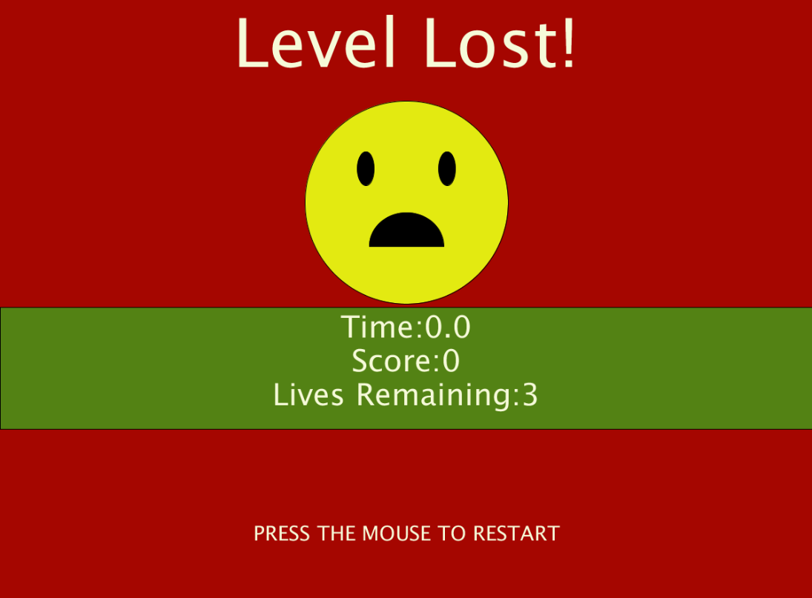

# BLOCK BREAKER

## Overview 
Block Breaker is a single user game. It involves a ball being bounced around the screen, in an effort to hit all the blocks, destroying them in order to win the game.
The goal is to complete this task before all lives are lost or it is GAME OVER.
- The game has 3 levels in total, increasing in difficulty after each level is passed. The user has 3 tries to finish the level or else it is Game Over, and the 
game begins again from Level 1. 

## How to Play
### Overview
At the beginning of each level, press the mouse the get the ball moving, when the level number is no longer visible. Then use the mouse to guide the slider to the left and right. Use the slider to bounce the ball to hit another block. If the ball misses the slider and hits the bottom edge of the screen, a life is lost. Each level has 3 Lives. If all lives are lost before the level is completed, then the game begins again from Level 1, so be careful.

### Destroying a Block
It takes 3 hits from the ball to destory a block.

Hit 1 : 

On the first hit the block begins to crack

Hit 2: 

On the second hit, the block cracks some more

Hit 3: And finally on the third hit the block disapears, in other words is destroyed.

### Obstacles
Levels 2 and 3 include obstacles, which are the red blocks, that the ball only bounce off of. They cannot be destroyed.

### Increasing Speed
Also, for Levels 2 and 3, after a block is destroyed the ball's speed begins to increase, so be careful.

## Time Bonus
Lastly, the faster the each level is finished the better the score. So try to finish as quickly as possible.

## Game Stages
### How to Play Screen

### Start Screen

### Level Screen

### Level Won

### Game Over

### Game Won

## Major Problems and Modifications
- My most difficult problem was the collision detection. I have lost count of the different solutions I tried to see if it would work. When the change in the speed is only 1, my inital code of detecting an overlap between the ball and the slider as well as the ball and the level blocks, was sound. However, because the speeds for Levels 2 and 3 increase once a block is destroyed, the greater the value of the speed, the more the ball overalps with the game objects, and eventually the ball would end up inside the object and glitch. So I had to find a different solution.
  - The best solution I found, was to make the ball center position the radius distance from the block and slider, whenever it collided with these objects. This solution is not perfect however, because for the corners if the center position of the circle is changed the, change is visible. 
- Another difficulty that I had was witht the sound files. I forgot that Processing works by calling the draw function. a certain number of times per second, and for each draw and the functions within, if the conditions are true, will be called. Therefore if a sound file is called, the sound begins to play and for each draw, a new one is played, creating an overlap of sounds. 
  - Solution: Create a boolean variable that keeps track of whether a sound has been played or not. If the sound has been played, then the variable becomes true. And for each new level, the variable has to be reinitialized to false.
- The next difficulty I had was with the Level Screen. This is the screen that shows the Level the user is currently playing. It is displayed after the user presses start and before the level itself is displayed. My concern was the number of events that were required for different actions to take place. The user has to press the mouse several times throughout the game and I did not want there to have to be a mouse event to transition from this screen to the level itself, so I had to figure out a way to do this smoothly
  - The solution I found included transparency. For the objects being displayed on the level screen, I added an transparency variable to the different fill statements. And once the user pressed start on the Welcome Screen, this variable was decreased until it became 0. Upon reaching 0, the user can finally begin playing the level itself. I really like this because it provided a nice transition into the level itself.
