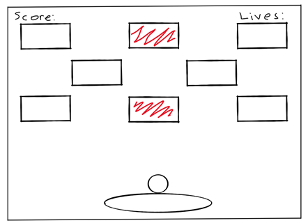
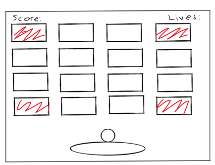
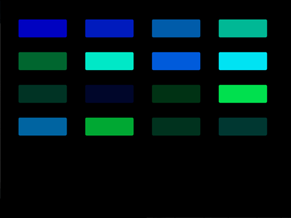
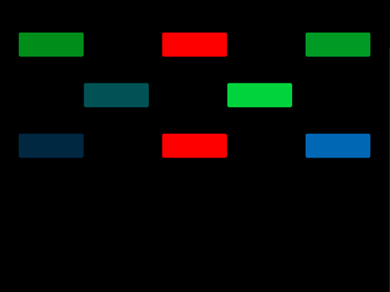
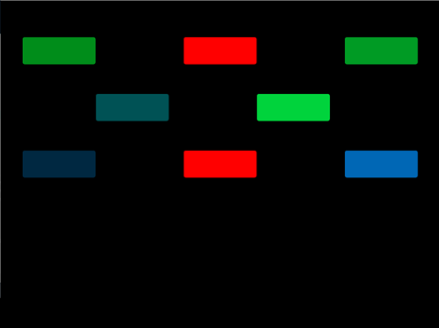
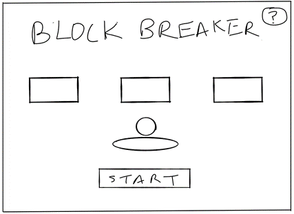
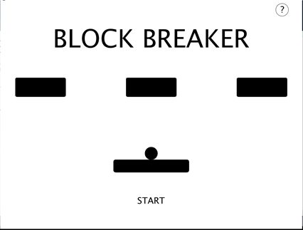
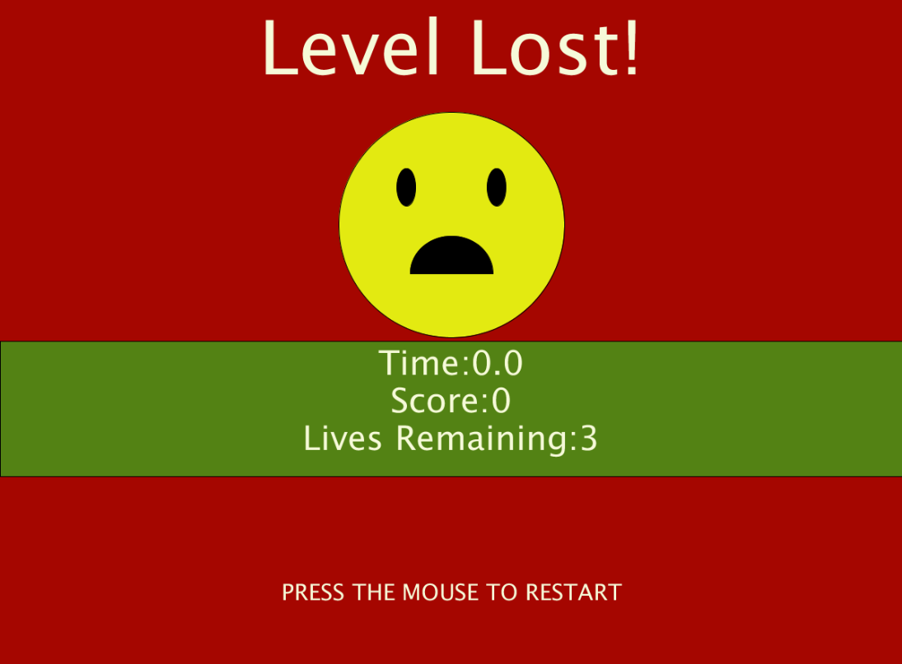
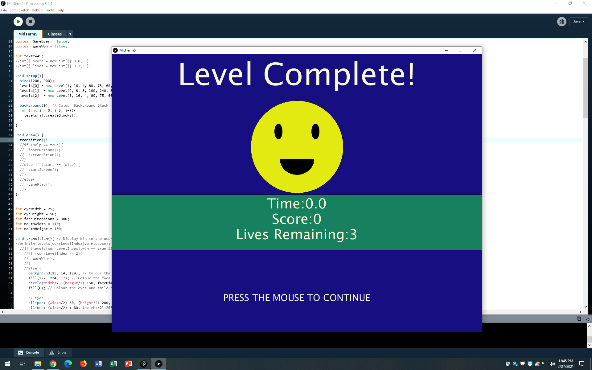
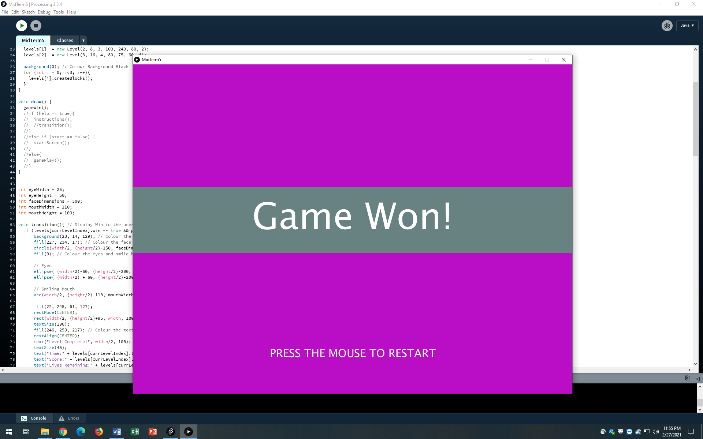

# Block Breaker 2.0 
## Preliminary Description
Block Breaker is a single user game. It involves a ball being bounced around the screen, in an effort to hit all the blocks, destroying them in order to win the game.
The goal is to complete this task before all lives are lost or it is GAME OVER.
- The game is to begin with a welcome screen, which has a Start Button and a Help Button.
  - The Start Button – the user presses it to begin the game.
  - The Help Button – the user presses it to view the game instructions. 
- The game has 3 levels in total, increasing in difficulty after each level is passed. The user has 3 tries to finish the level or else it is Game Over, and the 
game begins again from Level 1. 
- After selecting the Start Button, Level 1 is displayed with the blocks for this level. The user presses the mouse to get the ball moving, and tries to hit all 
the blocks, breaking them. It takes 3 hits to destroy a block. Each time a block is hit, more cracks appear until the third hit where it is destroyed. If the ball 
misses the slider and hits the bottom of the screen, a life is lost, and the ball and slider’s position is reset.
- This continues until the level is won or all lives are lost, meaning Game Over. 
- If the user wins the level, a congratulations screen is displayed, with a continue button for the user to select to move on to the next level.
- Similar as above is Levels 2 and 3. The major difference now, is that there are now obstacles that cannot be broken by the ball, and after each block is hit the 
balls speed increased. If a life is lost, then the speed is reset.
- If the user wins all the levels, then a final congratulatory screen is displayed, and a Restart Button is displayed that the user can select to restart from Level 1. 

## February 22, 2021

### Accomplished Today:
- Design 2 Additional Levels
- Write the code to incorporate the different blocks for each level. 
- Pictures for the Block Damage

#### Design for Additional Levels

##### Level 2

##### Level 3


#### Coding the Blocks for Each Level
For the blocks for each level, I used arrays. Each array had its own variables regarding the starting positions for each block, the number of rows, the vertical 
gaps as well as the horizontal gaps between each block. 

Then using a createBlocks Function, which accepted as arguments the empty level array and its corresponding variables, each array of blocks was created. 

Below you will see red blocks. These have been made to be obstacles; therefore, I needed a way to track them in the array. So, I made the block have an obstacle 
variable that is True or False. And when creating the blocks, depending on the index for the obstacles, the condition was True or False. 

#### Note
Because the number of blocks per level and the location of the obstacles were different for each level, I had to pass an integer which represented the specific 
level for the array of blocks being created.

Code for Creating the Blocks
````
void createBlocks(int level, Block[] blocks, int rows, int yPos, int XGAP, int YGAP){

  if (level == 1 || level == 3){
      int numberOfRows = 0;
      int blockIndex = 0;
      
    while(numberOfRows<rows && yPos<(height-BLOCKHEIGHT)) { // Track the number of rows that have been created and ensures the rows do not go offscreen
      
      for (int xPos = XGAP; xPos<(width-BLOCKWIDTH); xPos += (XGAP+BLOCKWIDTH)){ // Change the x Position for each new Block 
        if (level == 3 && (blockIndex == 0 || blockIndex == 3 || blockIndex == 12 || blockIndex == 15)){
          blocks[blockIndex] = new Block(xPos, yPos, true); // Create each individual block (obstacle)
        }
        else{
          blocks[blockIndex] = new Block(xPos, yPos, false); // Create each individual block
        }
        blockIndex++;// Increment the block index
      }
      numberOfRows = numberOfRows + 1; // Increment the number of created rows
      yPos += (YGAP+BLOCKHEIGHT); // Increase the y Position for the next Row
    } 
  }
  else{
      int blockIndex = 0;  
      //row 1
      for (int xPos = 60; xPos<(width-BLOCKWIDTH); xPos += (XGAP+BLOCKWIDTH)){ // Change the x Position for each new Block 
        if (blockIndex == 1){
          blocks[blockIndex] = new Block(xPos, yPos, true); // Create each individual block (obstacle)
        }
        else{
          blocks[blockIndex] = new Block(xPos, yPos, false); // Create each individual block
        }
        blockIndex++;// Increment the block index
      }
      yPos += (YGAP+BLOCKHEIGHT); // Increase the y Position for the next Row
      
      //row 2
      for (int xPos = 260; xPos<(width-BLOCKWIDTH); xPos += (XGAP+BLOCKWIDTH)){ // Change the x Position for each new Block 
        if (blockIndex == 1 || blockIndex == 6){
          blocks[blockIndex] = new Block(xPos, yPos, true); // Create each individual block
        }
        else{
          blocks[blockIndex] = new Block(xPos, yPos, false); // Create each individual block
        }
        blockIndex++;// Increment the block index
      }
      yPos += (YGAP+BLOCKHEIGHT); // Increase the y Position for the next Row    
      
      //row 3
      for (int xPos = 60; xPos<(width-BLOCKWIDTH); xPos += (XGAP+BLOCKWIDTH)){ // Change the x Position for each new Block 
        if (blockIndex == 6){
          blocks[blockIndex] = new Block(xPos, yPos, true); // Create each individual block (obstacle)
        }
        else{
          blocks[blockIndex] = new Block(xPos, yPos, false); // Create each individual block
        }
        blockIndex++;// Increment the block index
      }
    }
}
````

#### Result:

##### Level 1

##### Level 2

##### Level 3


### Pictures for Block Damage
Additionally, I created images for the cracks which are to appear when the blocks are hit. Initally I drew squares with the cracks in them, but I needed the transparent background. So I used the website [remove.bg](https://www.remove.bg/) to remove the background. The goal is to place the image over the block in the game whenever it is hit. 

##### Damage 1

##### Damage 2


#### Reflections
- In hindsight, it makes sense to make a class for the levels themselves. Each with its own array of blocks, and corresponding variables for the number of rows, 
the vertical gaps as well as the horizontal gaps between each block. Technically, I am doing that now so a class would be a more effective approach.
- Completing the blocks for the levels is a step in the right direction to creating the game, as without them, the game cannot work. 
- But I need to create the classes for the Levels because their respective array blocks will be used throughout the code. 
- I will need to add an image variable to the block class for the damage images, so they can then be displayed when the block is hit. 

## February 24, 2021

### Accomplished Today:
- Created the Levels Class
- Completed Level Fuctionality for Breaking Blocks After 3 Hits
- Designed the Home Screen

#### Levels Class
Having realized that it would be more effective to have a class for the game levels, I did just that. Utlizing the variables for array of blocks, and corresponding variables for the number of rows, the starting y position for the first block, the vertical gaps as well as the horizontal gaps between each block. 
````
class Level {
  int numOfBlocks, rows, yPos, xGap, yGap, gameLevel;
  Block[] blocks;
  
  Level(int level, int totalBlocks, int numOfRows, int yPosition, int verticalGap, int horizontalGap) {
    gameLevel = level;
    numOfBlocks = totalBlocks;
    rows = numOfRows;
    yPos =yPosition;
    xGap = verticalGap;
    yGap = horizontalGap;
    blocks = new Block[numOfBlocks];
  }
}
````
Then I created three level objects for each level, which were used thoughout the code, in order for the game to run.

Because the ball had to collide with the specific blocks for a level, I made the collision method of the block class accept the current level, and utilize that level's block variable to determine if a collision was taking taking place. 


#### Breaking Blocks After 3 Hits
To make the game more difficult, the ball has to hit the block three times in total for it to be destroyed. To make this possible, I added a varaible to the Block class, damage which is initalized to zero and each time a collision takes place, it is incremented until it becomes three. At this point, I considered the fact that the game has to restart. Instead of deleting the Block object, it made sense to just not display it. So I added another variable called show, which is either true or false. Initially it is true, meaning it has to be displayed, and when it is "destroyed" it becomes false, so it is not displayed on screen or used in further collisions.

````
if (level.blocks[i].show == true) { //If the block has not been destroyed yet
        //Check if the ball has hit the block
        if(x+radius >= level.blocks[i].x && x-radius <= (level.blocks[i].x + BLOCKWIDTH) && y+radius >= level.blocks[i].y && y-radius <= (level.blocks[i].y + BLOCKHEIGHT)){ 
          if (level.blocks[i].obstacle == false){ //Checks if the block is an obstacle
            level.blocks[i].damage ++; //If it is not an obstacle, then increment the damage variable
             if (level.blocks[i].damage == 3) { // If the damage variable is 3, then "destroy" the blok by not displaying it.
               level.blocks[i].show = false;
             }
          }         
````
#### Design the Home Screen
For the home screen I did a sketch to outline the screen itself. The user must click start to start the game and simply has to move their mouse over the question mark to see the game instructions. 


Sketch



Homescreen



#### Reflections
- Since the game is to begin with the instructions, the help button that was added to the home screen is no longer required. 

## February 27, 2021

### Accomplished Today:
- Levels Array
- Level Complete, Level Lost and Game Won Screens
- Restart 

#### Levels Class
- Again, I realized that instead of having mutltiple lines of code, for each level, it made sense to have an array of levels, with a varibale tracking the current Level. So that is what I did. I created an array of levels, called levels, and added an integer variable currlevel, to track the current Level. 
- Whilst coding, I realized it would be better to have the variable instead be the currLevelIndex, because the variable is incremented at different points, so to prevent Array Index errors, I decided to use the variable as the index instead. 
- I also had had, separate variables for the scores and lives for each variable, so I added those to the levels class, as well as a win variable to check if the level had been won. 
- Additionally, to check if the level was won, I decided to check if the blocks Remaining were equal to zero, in other words if all blocks wer destoryed. But for levels 2 and 3, becuase their blocks involve the obstacles, I had to consider them in the calculation for the blocks remaining. 
- and finally, to make it seem more like a fame, I added a time variable for the level, so the user can see how long it took to complete a level.

The following is the final product.

````
class Level {
  int numOfBlocks, rows, yPos, xGap, yGap, gameLevel, blocksRemaining, score, lives;
  Block[] blocks;
  boolean win;
  float time;
  
  Level(int level, int totalBlocks, int numOfRows, int yPosition, int verticalGap, int horizontalGap, int numOfObstacles) {
    gameLevel = level;
    numOfBlocks = totalBlocks;
    blocksRemaining = totalBlocks-numOfObstacles;
    rows = numOfRows;
    yPos = yPosition;
    xGap = verticalGap;
    yGap = horizontalGap;
    blocks = new Block[numOfBlocks];
    win = false;
    score = 0;
    lives = 3;
    time = 0;
  } 
````

#### Level Complete, Level Lost and Game Won Screens


````
if (level.blocks[i].show == true) { //If the block has not been destroyed yet
        //Check if the ball has hit the block
        if(x+radius >= level.blocks[i].x && x-radius <= (level.blocks[i].x + BLOCKWIDTH) && y+radius >= level.blocks[i].y && y-radius <= (level.blocks[i].y + BLOCKHEIGHT)){ 
          if (level.blocks[i].obstacle == false){ //Checks if the block is an obstacle
            level.blocks[i].damage ++; //If it is not an obstacle, then increment the damage variable
             if (level.blocks[i].damage == 3) { // If the damage variable is 3, then "destroy" the blok by not displaying it.
               level.blocks[i].show = false;
             }
          }         
````
#### Restart






#### Reflections
 


