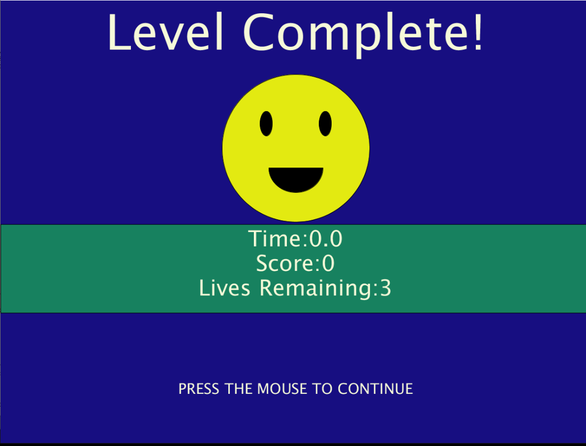
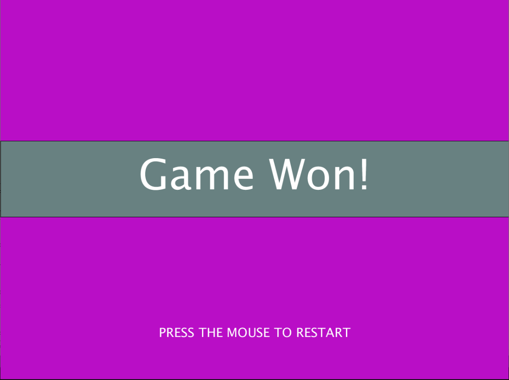

# Block Breaker 2.0 
## Preliminary Description
Block Breaker is a single user game. It involves a ball being bounced around the screen, in an effort to hit all the blocks, destroying them in order to win the game.
The goal is to complete this task before all lives are lost or it is GAME OVER.
- The game is to begin with a welcome screen, which has a Start Button and a Help Button.
  - The Start Button – the user presses it to begin the game.
  - The Help Button – the user presses it to view the game instructions. 
- The game has 3 levels in total, increasing in difficulty after each level is passed. The user has 3 tries to finish the level or else it is Game Over, and the 
game begins again from Level 1. 
- After selecting the Start Button, Level 1 is displayed with the blocks for this level. The user presses the mouse to get the ball moving, and tries to hit all 
the blocks, breaking them. It takes 3 hits to destroy a block. Each time a block is hit, more cracks appear until the third hit where it is destroyed. If the ball 
misses the slider and hits the bottom of the screen, a life is lost, and the ball and slider’s position is reset.
- This continues until the level is won or all lives are lost, meaning Game Over. 
- If the user wins the level, a congratulations screen is displayed, with a continue button for the user to select to move on to the next level.
- Similar as above is Levels 2 and 3. The major difference now, is that there are now obstacles that cannot be broken by the ball, and after each block is hit the 
balls speed increased. If a life is lost, then the speed is reset.
- If the user wins all the levels, then a final congratulatory screen is displayed, and a Restart Button is displayed that the user can select to restart from Level 1. 

## February 22, 2021

### Accomplished Today:
- Design 2 Additional Levels
- Write the code to incorporate the different blocks for each level. 
- Pictures for the Block Damage

#### Design for Additional Levels

##### Level 2

##### Level 3


#### Coding the Blocks for Each Level
For the blocks for each level, I used arrays. Each array had its own variables regarding the starting positions for each block, the number of rows, the vertical 
gaps as well as the horizontal gaps between each block. 

Then using a createBlocks Function, which accepted as arguments the empty level array and its corresponding variables, each array of blocks was created. 

Below you will see red blocks. These have been made to be obstacles; therefore, I needed a way to track them in the array. So, I made the block have an obstacle 
variable that is True or False. And when creating the blocks, depending on the index for the obstacles, the condition was True or False. 

#### Note
Because the number of blocks per level and the location of the obstacles were different for each level, I had to pass an integer which represented the specific 
level for the array of blocks being created.

Code for Creating the Blocks
````
void createBlocks(int level, Block[] blocks, int rows, int yPos, int XGAP, int YGAP){

  if (level == 1 || level == 3){
      int numberOfRows = 0;
      int blockIndex = 0;
      
    while(numberOfRows<rows && yPos<(height-BLOCKHEIGHT)) { // Track the number of rows that have been created and ensures the rows do not go offscreen
      
      for (int xPos = XGAP; xPos<(width-BLOCKWIDTH); xPos += (XGAP+BLOCKWIDTH)){ // Change the x Position for each new Block 
        if (level == 3 && (blockIndex == 0 || blockIndex == 3 || blockIndex == 12 || blockIndex == 15)){
          blocks[blockIndex] = new Block(xPos, yPos, true); // Create each individual block (obstacle)
        }
        else{
          blocks[blockIndex] = new Block(xPos, yPos, false); // Create each individual block
        }
        blockIndex++;// Increment the block index
      }
      numberOfRows = numberOfRows + 1; // Increment the number of created rows
      yPos += (YGAP+BLOCKHEIGHT); // Increase the y Position for the next Row
    } 
  }
  else{
      int blockIndex = 0;  
      //row 1
      for (int xPos = 60; xPos<(width-BLOCKWIDTH); xPos += (XGAP+BLOCKWIDTH)){ // Change the x Position for each new Block 
        if (blockIndex == 1){
          blocks[blockIndex] = new Block(xPos, yPos, true); // Create each individual block (obstacle)
        }
        else{
          blocks[blockIndex] = new Block(xPos, yPos, false); // Create each individual block
        }
        blockIndex++;// Increment the block index
      }
      yPos += (YGAP+BLOCKHEIGHT); // Increase the y Position for the next Row
      
      //row 2
      for (int xPos = 260; xPos<(width-BLOCKWIDTH); xPos += (XGAP+BLOCKWIDTH)){ // Change the x Position for each new Block 
        if (blockIndex == 1 || blockIndex == 6){
          blocks[blockIndex] = new Block(xPos, yPos, true); // Create each individual block
        }
        else{
          blocks[blockIndex] = new Block(xPos, yPos, false); // Create each individual block
        }
        blockIndex++;// Increment the block index
      }
      yPos += (YGAP+BLOCKHEIGHT); // Increase the y Position for the next Row    
      
      //row 3
      for (int xPos = 60; xPos<(width-BLOCKWIDTH); xPos += (XGAP+BLOCKWIDTH)){ // Change the x Position for each new Block 
        if (blockIndex == 6){
          blocks[blockIndex] = new Block(xPos, yPos, true); // Create each individual block (obstacle)
        }
        else{
          blocks[blockIndex] = new Block(xPos, yPos, false); // Create each individual block
        }
        blockIndex++;// Increment the block index
      }
    }
}
````

#### Result:

##### Level 1

##### Level 2

##### Level 3


### Pictures for Block Damage
Additionally, I created images for the cracks which are to appear when the blocks are hit. Initally I drew squares with the cracks in them, but I needed the transparent background. So I used the website [remove.bg](https://www.remove.bg/) to remove the background. The goal is to place the image over the block in the game whenever it is hit. 

##### Damage 1

##### Damage 2


#### Reflections
- In hindsight, it makes sense to make a class for the levels themselves. Each with its own array of blocks, and corresponding variables for the number of rows, 
the vertical gaps as well as the horizontal gaps between each block. Technically, I am doing that now so a class would be a more effective approach.
- Completing the blocks for the levels is a step in the right direction to creating the game, as without them, the game cannot work. 
- But I need to create the classes for the Levels because their respective array blocks will be used throughout the code. 
- I will need to add an image variable to the block class for the damage images, so they can then be displayed when the block is hit. 

## February 24, 2021

### Accomplished Today:
- Created the Levels Class
- Completed Level Fuctionality for Breaking Blocks After 3 Hits
- Designed the Home Screen

#### Levels Class
Having realized that it would be more effective to have a class for the game levels, I did just that. Utlizing the variables for array of blocks, and corresponding variables for the number of rows, the starting y position for the first block, the vertical gaps as well as the horizontal gaps between each block. 
````
class Level {
  int numOfBlocks, rows, yPos, xGap, yGap, gameLevel;
  Block[] blocks;
  
  Level(int level, int totalBlocks, int numOfRows, int yPosition, int verticalGap, int horizontalGap) {
    gameLevel = level;
    numOfBlocks = totalBlocks;
    rows = numOfRows;
    yPos =yPosition;
    xGap = verticalGap;
    yGap = horizontalGap;
    blocks = new Block[numOfBlocks];
  }
}
````
Then I created three level objects for each level, which were used thoughout the code, in order for the game to run.

Because the ball had to collide with the specific blocks for a level, I made the collision method of the block class accept the current level, and utilize that level's block variable to determine if a collision was taking taking place. 


#### Breaking Blocks After 3 Hits
To make the game more difficult, the ball has to hit the block three times in total for it to be destroyed. To make this possible, I added a varaible to the Block class, damage which is initalized to zero and each time a collision takes place, it is incremented until it becomes three. At this point, I considered the fact that the game has to restart. Instead of deleting the Block object, it made sense to just not display it. So I added another variable called show, which is either true or false. Initially it is true, meaning it has to be displayed, and when it is "destroyed" it becomes false, so it is not displayed on screen or used in further collisions.

````
if (level.blocks[i].show == true) { //If the block has not been destroyed yet
        //Check if the ball has hit the block
        if(x+radius >= level.blocks[i].x && x-radius <= (level.blocks[i].x + BLOCKWIDTH) && y+radius >= level.blocks[i].y && y-radius <= (level.blocks[i].y + BLOCKHEIGHT)){ 
          if (level.blocks[i].obstacle == false){ //Checks if the block is an obstacle
            level.blocks[i].damage ++; //If it is not an obstacle, then increment the damage variable
             if (level.blocks[i].damage == 3) { // If the damage variable is 3, then "destroy" the blok by not displaying it.
               level.blocks[i].show = false;
             }
          }         
````
#### Design the Home Screen
For the home screen I did a sketch to outline the screen itself. The user must click start to start the game and simply has to move their mouse over the question mark to see the game instructions. 


Sketch


Homescreen


#### Reflections
- Since the game is to begin with the instructions, the help button that was added to the home screen is no longer required. 

## February 27, 2021

### Accomplished Today:
- Levels Array
- Level Complete, Level Lost and Game Won Screens
- Restart 

#### Levels Class
- Again, I realized that instead of having mutltiple lines of code, for each level, it made sense to have an array of levels, with a varibale tracking the current Level. So that is what I did. I created an array of levels, called levels, and added an integer variable currlevel, to track the current Level. 
- Whilst coding, I realized it would be better to have the variable instead be the currLevelIndex, because the variable is incremented at different points, so to prevent Array Index errors, I decided to use the variable as the index instead. 
- I also had had, separate variables for the scores and lives for each variable, so I added those to the levels class, as well as a win variable to check if the level had been won. 
- Additionally, to check if the level was won, I decided to check if the blocks Remaining were equal to zero, in other words if all blocks wer destoryed. But for levels 2 and 3, becuase their blocks involve the obstacles, I had to consider them in the calculation for the blocks remaining. 
- and finally, to make it seem more like a fame, I added a time variable for the level, so the user can see how long it took to complete a level.

The following is the final product.

````
class Level {
  int numOfBlocks, rows, yPos, xGap, yGap, gameLevel, blocksRemaining, score, lives;
  Block[] blocks;
  boolean win;
  float time;
  
  Level(int level, int totalBlocks, int numOfRows, int yPosition, int verticalGap, int horizontalGap, int numOfObstacles) {
    gameLevel = level;
    numOfBlocks = totalBlocks;
    blocksRemaining = totalBlocks-numOfObstacles;
    rows = numOfRows;
    yPos = yPosition;
    xGap = verticalGap;
    yGap = horizontalGap;
    blocks = new Block[numOfBlocks];
    win = false;
    score = 0;
    lives = 3;
    time = 0;
  } 
````

Code for collisison with block
````
if (level.blocks[i].show == true) { //If the block has not been destroyed yet
        //Check if the ball has hit the block
        if(x+radius >= level.blocks[i].x && x-radius <= (level.blocks[i].x + BLOCKWIDTH) && y+radius >= level.blocks[i].y && y-radius <= (level.blocks[i].y + BLOCKHEIGHT)){ 
          if (level.blocks[i].obstacle == false){ //Checks if the block is an obstacle
            level.blocks[i].damage ++; //If it is not an obstacle, then increment the damage variable
             if (level.blocks[i].damage == 3) { // If the damage variable is 3, then "destroy" the blok by not displaying it.
               level.blocks[i].show = false;
             }
          }         
````
#### Level Complete, Level Lost and Game Won Screens
Level Lost - is displayed when all lives are lost on a level. The user must then begin again from level 1, hence the restart prompt

Note: Preliminary screen, that is why the score and time are zero.

Level Complete - is displayed when the user has destoryed all the blocks on the level. Then there is a prompt to move on to the next level

Note: Preliminary screen, that is why the score and time are zero.

Game Won - is displayed after the user has completed all levels. The user can then restart by pressing the mouse


#### Restart
Considering the display decision that I made earlier, restarting was much easier than having to create new blocks for each level. Instead, each level's block has their show turned back to true and their damage changed to 0. In addition, the level score is reinitialized to 0, the level win turned to false, and the number of lives made 3.

````
 void reset() {
   score = 0;
   lives = 3;
   win = false;
   blocksRemaining = numOfBlocks-numOfObstacles;
   for(int i=0; i<numOfBlocks; i++){
     blocks[i].show = true;
     blocks[i].damage = 0;
   }
 }
 
````

For the levels themselves, if a level is lost, the same principal applies, however a for loop is used to iterate from the current evel to all previous levels and reset each once.

````
void resetLevels(){
  for(int i = currLevelIndex; i>= 0; i--){
    levels[i].reset();
  }
  currLevelIndex=0;
  pause = false; // Determines if the game should be paused to display the Level Complete Scrren
  start = false; // Dtermines if the levels should be seen yet
  startLevel = false; // Determines if the level should begin or not
  gameWon = false; // Gme has not been won yet
}
 
````
#### Reflections
- I need to add the instructions screen to the beginning of the screen. I don't want to add it yet, in case my game design for some reason changes between now and the submission deadline. Plan - use an image because it is easier than using the text code in Processing
- Maybe add a bit more to the Game Won screen. It seems a bit bland.
- I continue to change foundational elements of my code. Try and write the pseudocode before I type it in Processing. 
- Add the names of Each level to the Level Screen, so the user can know what level it is. Maybe then add the specific level that has been lost or completed to these screens respectively. 

## March 1, 2021

### Accomplished Today:
- Added the images for a Damaged Block
- Added Game Sounds
- Added Time Display
- Increased Speed for Levels 2 and 3

#### Added the Images for a Damaged Block
Since a block has to be hit 3 times for it to be destroyed, the images that I designed were added into two PImage variables for each block. And depending on the value of the damage variable then a different one is displayed on top of the block.

Overall view of the Game When a Block is Hit


Damage = 1


Damage = 2


#### Added Time Display
Additionally I added a display of the time it takes to complete a level during game play. I had tried to use the frameRate varibale to do the calculation, because it is the rate of the number of frames per second, but the seconds variable began fluctuating at certain points so I decided to use 60 and 3600 instead, given that the frameRate is 60 frames per second. 
````
void updateTime() {
  minutes = frames/3600;
  seconds = frames/60;
}
````

Gif Showing Time Display as well as Block Cracks


#### Game Sounds
I also added four different sounds to the game.
- One for when a level is lost
- Another for when a level is completed
- A sound for when the ball hits a block
- And background music whilst a level is being played.

I had to utilize additional boolean variables to determine if a sound had already been played, for example with the level completed screen, so as to not have an active repition each time the sound file was completed. 

For example
````
if (win.isPlaying() == false && played == false){ //win is a soundFile for the level completed sound
  win.play();
  played = true;
}    
````


#### Increased Speed for Levels 2 and 3
Lastly, to make levels 2 and 3 more difficult, each time a brick is destroyed, the ySpeed is increased by 1 and the xSpeed is increased by 3. Here I realized that if it is that one of these values is negative, then I would have to subtract the 1, and the 3, otherwise it would do the opposite and make the speed slower, because I am adding a positive number to a negative number. 

````
  void increaseSpeed(){
    if(currLevelIndex!=0){
      if (xSpeed < 0){
        xSpeed -= 1;
      }
      else{
        xSpeed += 1;
      }
      
      if(ySpeed <0){
        ySpeed -= 3;
      }
      else{
        ySpeed += 3;
      }
    }

  }
````
Gif Showing the Ball's Increase in Speed


#### Reflections
- Increasing the speed showed that there were errors in my collision code that need to be fixed. When the speed is increased, the ball no longer bounces when it immediately comes into contact with a block or the slide. Parts of the ball overlap with these objects before it bounces and sometimes the ball is stuck within the slider. So I need to fix those bugs.
- Maybe I could add a sound at the beginning of the game, when the Instructions Screen and Welcome Screen are visible. 

## March 2, 2021

### Accomplished Today:
- Updated the Increase Speed of the Ball
- How to Play
- Background

#### Updated the Increase Speed of the Ball
I realized that the ball's speed had to increase by 1. The bigger the value that the speed incremented by, the more the ball overlapped with the blocks and the slider. The condition to decide if there is a collision, conisder's if the ball's edge is inside the block. By increasing the value of the speed this is therefore more likel. Thus, to minimize overlapping, the incrementing value was made 1. It took a while to figure this out.  

````
  void increaseSpeed(){
    if(currLevelIndex!=0){
      if (xSpeed < 0){
        xSpeed -= 1;
      }
      else{
        xSpeed += 1;
      }
      
      if(ySpeed <0){
        ySpeed -= 1;
      }
      else{
        ySpeed += 1;
      }
    }

  }
````

#### How To Play
For the Instructions screen, which is required at the beginning of the game, I deciced to write the instructions in a textbox in word, and then save the textbox as an image. This image was then used within a PImage variable and simply displayed. I found this much easier, than manipulating text code. Additionally, to make th background more interesting, I added an array of randomly placed small circles.

Here is the Result.


#### Background
Similarly, to the initial assignment that I did using Block Breaker, I used the stars as a background. I made them much thinner this time so as to get a more shooting star like display. This involved creating a Stars Class and an array of stars, which were shifted along the screen, displayed, and when they reached the end of the screen their position was reset. 


#### Reflections
- Collision detection is a lot more difficult than I had anticipated. And my method does not provide the desired result
- Making images of texts, is much easier than writing the code for the text line by line.


## March 3, 2021

### Accomplished Today:
- Added a Screen that displays the level number
- Updated Collision Detection
- Commented the Entire Code
- Fixed Time

#### Screen that Displays the Level Number
To make the game more organized, I added an additional screen that dislays the specific level that the user is playing. Instead of it being a mouse event that determines where or not this screen then transitions to the level itself, I created a transparency variable that causes the Level Screen to slowly fade out until the level itself comes into view. At this point, again to make the background more interesting, the array of circles were again displayed.

Code for Level Screen

````

void levelScreen(){
  fill(0, transparency); // Colour the background black
  rect(0,0, width, height); // Display a rectangle as the background
  fill(colorOptions[currLevelIndex], transparency); // Select the colour based on the level
  
  for(int i = 0; i<NUMBEROFSTARS; i++){
    circles[i].display(); // Display the background circles
  }
  
  textSize(150);
  textAlign(CENTER);
  text("LEVEL", width/2, (height/2)-130);
  text(currLevelIndex+1, width/2, (height/2)+100);
}

````


#### Updated Collision Detection
For my collision detection, as mentioned before, the more the speed becomes larger, the more the ball begins to overlap with the blocks. This also happened with the slider. To improve on this, I decided to change the code, and instead have that if the ball collides with the block or slider, the edge that it collides with is now the new ball position. This prevents the overlapping of the game objects as well as prevents the ball from ending up inside the different objects. It took a while to figure this out and [this website](https://www3.ntu.edu.sg/home/ehchua/programming/java/J8a_GameIntro-BouncingBalls.html) on bouncing balls also helped. In all honesty, the code is not perfect, because for the block corners, if you pay close attention you can see the shift in the y position. However, it is a much better improvement than what I had before, and is an area in which I can work on in the future.


#### Commented the Entire Code
I then spent a bit of time adding the necessary comments to different sections of the code. Of particular importance was the collision section which can be a bit difficult to follow. 

#### Fixed Time Again
I then realized that my code for updating the time was not correct. THe seconds segment was growing bigger than 60 when that should not be happening. I initially tried using modulus but I found that was not working so I used basic math instead.

````

 void updateTime() { 
   if(frames%60 == 0 && frames != 0){ // If frames is 60 and it s not the intial number of frames then a second has passed
     seconds += 1;
   }
   
   if(seconds == 60){ // If 60 seconds have passed
     minutes +=1;
     seconds = 0;
   }
 }

````


#### Reflections
- Once again, collision could use work, but for now, the basic functionality is possible. And I am happy the ball no longer is overlapping with the different game objects. Unfortunately I do not think I will be able to find a solution before the deadline, but I hope I eventually will. 


